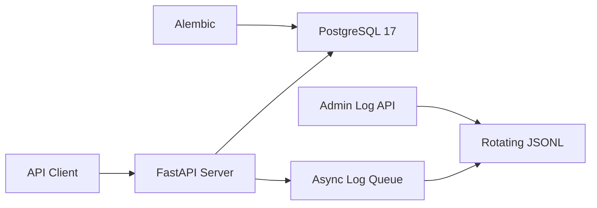

<div align="center">

<h1>Quant Foundry</h1>

<p><strong>A reliable FastAPI backend foundation for quantitative applications</strong></p>

<p>
Configuration, persistence, observability, and self-hosting in one clear, verifiable,
and maintainable service foundation.
</p>

<p>
  <a href="./pyproject.toml"></a>
  <a href="https://fastapi.tiangolo.com/"></a>
  <a href="./compose.yaml"></a>
  <a href="./compose.yaml"></a>
  <a href="./LICENSE"></a>
</p>

<p>
  <a href="#why-quant-foundry">Overview</a> ·
  <a href="#quick-start">Quick Start</a> ·
  <a href="#api">API</a> ·
  <a href="#development">Development</a> ·
  <a href="#contributing">Contributing</a>
</p>

<p>English | <a href="./README_ZH.md">简体中文</a></p>

</div>

> [!NOTE]
> Quant Foundry is in early development. The backend infrastructure is in place, but market data
> ingestion, strategy research, backtesting, and trade execution have not been implemented yet.

## Why Quant Foundry?

Quantitative systems vary in their business capabilities, but they share the same operational needs:
configuration, databases, migrations, logging, and deployment. Quant Foundry provides these concerns
as a well-defined foundation so future development can focus on market data, research, backtesting,
and trading.

| Concern | Current implementation |
| --- | --- |
| Fast deployment | One `make selfhost` command builds, migrates, starts, and verifies the stack |
| Configuration safety | Strict Pydantic Settings validation and an auto-generated 256-bit database password |
| Data evolution | SQLAlchemy session management and versioned Alembic migrations |
| Observability | Structured JSON logs, asynchronous writes, rotation, compression, and an admin query API |
| Runtime reliability | PostgreSQL and Server health checks, persistent volumes, and graceful shutdown |
| Behavioral verification | Unit tests for configuration, database, server, and logging modules |

## Architecture



The application connects to PostgreSQL through explicit settings and manages schema changes with
Alembic. Request and application events enter an asynchronous queue before being written to daily
rotating JSONL files. The admin API performs bounded queries across current and historical log files.

## Quick Start

Self-hosting is the shortest path to a working installation. Install Docker, Docker Compose v2,
and `make`, then run:

```bash
git clone https://github.com/Li2Wh1te/quant-foundry.git
cd quant-foundry
make selfhost
```

Once the stack is ready, open:

| URL | Purpose |
| --- | --- |
| [http://127.0.0.1:8000](http://127.0.0.1:8000) | API root |
| [http://127.0.0.1:8000/docs](http://127.0.0.1:8000/docs) | Swagger UI |
| [http://127.0.0.1:8000/redoc](http://127.0.0.1:8000/redoc) | ReDoc |
| [http://127.0.0.1:8000/readyz](http://127.0.0.1:8000/readyz) | Database readiness check |

The Server and PostgreSQL host ports bind to `127.0.0.1` by default and are not directly exposed
to external networks.

<details>
<summary><strong>What happens during the first deployment?</strong></summary>

1. Create `.env` from `.env.example` with `0600` permissions;
2. Generate a random 256-bit PostgreSQL password with Python `secrets`;
3. Build the Server image from the current checkout;
4. Create persistent volumes and start PostgreSQL;
5. Apply all Alembic migrations;
6. Start the Server and wait for `/readyz` to verify a real database query.

Subsequent runs reuse the existing configuration, database password, and persistent volumes.

</details>

## Operations

```bash
make selfhost-status   # Show container status
make selfhost-logs     # Follow PostgreSQL and Server logs
make selfhost-psql     # Open psql
make selfhost-migrate  # Apply pending database migrations
make selfhost-down     # Stop the stack and preserve data
make selfhost-reset    # Delete database and log data, then redeploy
```

> [!WARNING]
> `make selfhost-reset` permanently deletes the database and log volumes managed by Docker Compose
> after confirmation.

Do not change only the password in `.env` after the database has been initialized. Doing so leaves
the configuration inconsistent with the PostgreSQL role. Change both with `ALTER ROLE`, or use
`make selfhost-reset` to reinitialize the stack when the existing data is not needed.

## API

See the generated OpenAPI documentation at `/docs` for complete request parameters and response
schemas.

| Method | Path | Description |
| --- | --- | --- |
| `GET` | `/` | Basic connectivity check |
| `GET` | `/readyz` | Execute `SELECT 1` to verify the database connection |
| `GET` | `/api/admin/logs` | Query local structured logs |
| `POST` | `/api/admin/logs/clear` | Hide logs created before the request |

Log queries support `keyword`, `level`, `method`, `status_class`, `path`, `start_time`, and
`end_time` filters. The default window is the last 24 hours. A request may cover at most 31 days
and return at most 1,000 records. Clearing logs does not truncate active files; physical files remain
subject to the configured retention policy.

> [!CAUTION]
> The admin log API does not currently include application-level authentication, and logs may contain
> sensitive operational context. Add authentication and access control at the application or reverse
> proxy layer before exposing the service to an untrusted network.

## Development

<details>
<summary><strong>Run from source</strong></summary>

### Requirements

- Python 3.12.2
- [uv](https://docs.astral.sh/uv/)
- An accessible PostgreSQL instance

The project requires Python 3.12.2 in `pyproject.toml` and locks the complete dependency graph in
`uv.lock`.

```bash
git clone https://github.com/Li2Wh1te/quant-foundry.git
cd quant-foundry
cp .env.example .env
```

Edit `.env`, set a real value for `QF_DATABASE_PASSWORD`, and make sure the configured PostgreSQL
user and database exist. Then run:

```bash
uv sync --locked
uv run alembic upgrade head
uv run python -m app
```

Run the complete test suite:

```bash
uv run python -m unittest discover -v
```

</details>

<details>
<summary><strong>Environment configuration</strong></summary>

All application settings use the `QF_` prefix and are loaded from `.env` in the project root.
See [`.env.example`](./.env.example) for complete descriptions and defaults.

| Setting | Description |
| --- | --- |
| `QF_ENVIRONMENT` | Runtime environment: `local`, `test`, or `production` |
| `QF_DEBUG` | Enable debug mode; this must be `false` in production |
| `QF_SERVER_HOST` / `QF_SERVER_PORT` | API bind address and port |
| `QF_DATABASE_*` | PostgreSQL host, port, user, password, and database name |
| `QF_LOG_DIR` / `QF_LOG_LEVEL` | Log directory and minimum log level |
| `QF_LOG_RETENTION_DAYS` | Retention period for rotated logs |
| `QF_LOG_QUEUE_SIZE` | Asynchronous log queue capacity |
| `QF_LOG_QUERY_MAX_FILES` | Maximum number of files scanned by one log query |

Do not commit `.env` or any real credentials.

</details>

<details>
<summary><strong>Database migrations</strong></summary>

After adding a SQLAlchemy model, import its module from `app/models/__init__.py`, then generate and
review the migration:

```bash
uv run alembic revision --autogenerate -m "describe the schema change"
uv run alembic upgrade head
```

Migration files are part of the codebase and should be committed with the corresponding model changes.

</details>

<details>
<summary><strong>Project structure</strong></summary>

```text
app/
├── core/                 # Configuration, logging setup, and request logging middleware
├── db/                   # SQLAlchemy sessions and Alembic migrations
├── logging/              # Log query logic and admin API
├── models/               # Domain models
├── __main__.py           # Local process entry point
└── main.py               # FastAPI application factory
scripts/                  # Self-hosting and environment initialization scripts
tests/                    # Unit tests
compose.yaml              # PostgreSQL and Server orchestration
Dockerfile                # Production Server image
Makefile                  # Common self-hosting commands
```

</details>

## FAQ

<details>
<summary><strong>Is this a ready-to-use quantitative trading platform?</strong></summary>

No. The current version provides backend infrastructure for quantitative applications. It does not
include market data providers, a strategy engine, backtesting, risk management, or order execution.
The project status will be updated as these domain capabilities are implemented.

</details>

<details>
<summary><strong>Can I expose the service directly to the public internet?</strong></summary>

This is not recommended. Ports bind to the local host by default. Before exposing the service,
configure TLS, authentication, access control, and a trusted reverse proxy. Never expose the admin
log API without authentication.

</details>

<details>
<summary><strong>Where is self-hosted data stored?</strong></summary>

PostgreSQL data and Server logs are stored in separate persistent volumes managed by Docker Compose.
`make selfhost-down` preserves these volumes; `make selfhost-reset` deletes them after confirmation.

</details>

## Contributing

Issues with reproducible bug reports and focused design discussions are welcome, as are Pull Requests.
Before submitting code:

1. Create a focused branch from the latest `main`;
2. Add or update tests for behavioral changes;
3. Run `uv run python -m unittest discover -v` and confirm that it passes;
4. Explain the problem, implementation, verification, and compatibility impact in the Pull Request.

For larger changes to public APIs, data models, or deployment behavior, open an Issue first to align
on goals and scope.

## License

This project is licensed under the [Apache License 2.0](./LICENSE).

Copyright 2026 Quant Foundry contributors.
