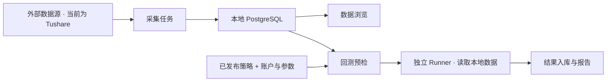
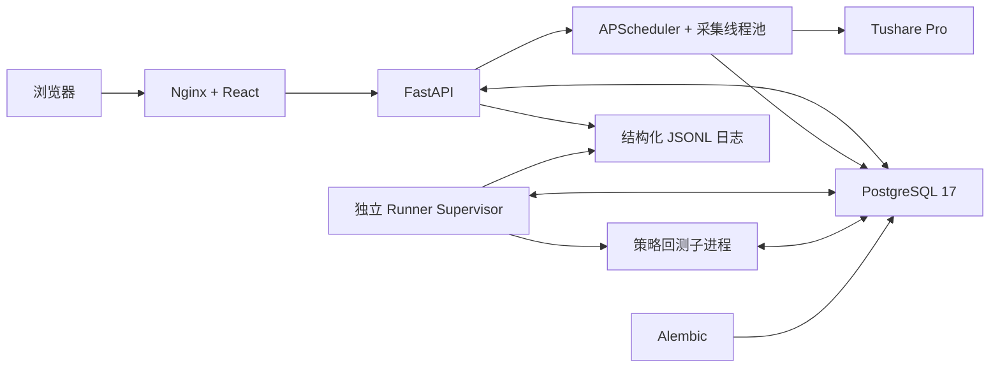

<div align="center">

<h1>Quant Foundry</h1>

<p><strong>面向个人开发者的自托管量化研究工作台</strong></p>

<p>把数据、投资想法与策略验证连接起来，让个人投资者也能开展系统化研究。</p>

<p>
  <a href="./LICENSE"></a>
  <a href="./compose.yaml"></a>
  <a href="./backend/pyproject.toml"></a>
  <a href="./frontend/package.json"></a>
</p>

<p>
  <a href="#为什么做这个项目">项目使命</a> ·
  <a href="#界面预览">界面预览</a> ·
  <a href="#当前能做什么">当前能力</a> ·
  <a href="#快速开始">快速开始</a> ·
  <a href="#第一次本地回测">首次回测</a> ·
  <a href="#路线图">路线图</a> ·
  <a href="#开发与运维">开发与运维</a>
</p>

<p>简体中文 | <a href="./README_EN.md">English</a></p>

</div>

> [!NOTE]
> 项目处于早期开发阶段。当前已接入 Tushare Pro，提供 ETF 数据管理、Python 策略工作台和
> 本地 ETF 日频回测能力。同花顺已支持连接管理及独立的基金、A 股和指数采集；股票回测、期货，
> 以及模拟交易、风控和实盘执行属于后续规划。

## 为什么做这个项目

个人投资者也应该有机会使用量化工具，把投资想法变成可以检查、验证和持续改进的研究过程。
Quant Foundry 希望降低这个过程的门槛，逐步缩小个人与专业机构在研究工具和方法上的差距。

我们从一套开源、可自托管的工作台开始：采集和管理数据，编写策略，用历史数据检验假设，
再通过报告和运行记录复盘结果。数据、私有策略源码和研究结果保存在自己的部署中；项目代码
开放，方便理解实现、扩展能力和参与建设。

当前主要面向有 Python 基础、愿意自行部署的个人量化开发者。长期希望服务更广泛的个人投资者，
逐步覆盖多种数据源和资产，并延伸到模拟交易、风险控制与实盘执行。ETF 是当前实现的起点。

## v0.3.0

本版统一了工作台的布局、字体、控件与新建流程，并补齐从数据配置到结果对比的研究流程：

- 在页面管理并加密保存数据源凭据，查看采集任务与数据覆盖。
- 为策略发布版本设置别名，按名称或代码搜索回测标的，使用分步 Drawer 检查并创建回测。
- 查看独立回测结果、持仓、成交和诊断，导出包含全部分页结果的 JSON。
- 比较 2–10 个已完成运行，将对比名称、运行顺序和参照运行保存到服务端。
- 清理未发布且无回测引用的策略，以及无回测引用的账户；有历史记录的对象保留归档或退役。

完整变更见 [CHANGELOG](./CHANGELOG.md) 和 [v0.3.0 Release](https://github.com/Li2Wh1te/quant-foundry/releases/tag/v0.3.0)。

## 界面预览

**ETF 行情详情**：查看本地日线数据，切换日、周、月、年 K 线、均线和复权视图。下图为新版行情工作区，使用隔离生成的示例行情，非真实市场数据。


<details>
<summary><strong>策略工作台与回测报告</strong></summary>

**策略工作台**：在浏览器中编辑 Python 草稿、维护参数并管理不可变的发布版本。截图来自
本地演示页面，仅使用仓库公开的 `hold` 模板与示例记录。


**回测分析**：在独立结果页查看收益、回撤、月度表现、持仓成交和运行诊断。下图使用隔离的
界面测试数据展示布局与交互，不代表实际引擎运行结果或投资业绩。


</details>

## 当前能做什么

| 环节 | 已实现的能力 |
| --- | --- |
| 数据采集 | Tushare 交易日历、ETF 基础资料、日线、复权因子、现金分红及停牌交易状态采集；按任务类型支持全量、增量或近期校验 |
| 数据浏览 | ETF 搜索与筛选、持久化自选、基础资料、K 线与均线、前后复权图表、复权因子明细、交易日历覆盖与同步状态 |
| 策略管理 | Python 源码与参数编辑、草稿保存、静态校验、带别名的不可变版本发布、历史查看、归档及未发布策略安全删除；私有源码存入 PostgreSQL |
| 账户与执行配置 | 回测账户、费用方案及其版本、使用记录及安全删除，初始资金与持仓、滑点模型和执行组件选择 |
| 本地回测 | 绑定已发布策略与固定标的，检查本地数据和运行配置，排队执行、查看进度、取消、重跑及追踪失败原因 |
| 结果分析 | 权益与回撤、现金与市值、绩效与费用指标、持仓与成交等明细，以及服务端保存的运行比较、配置差异、数据证据和 JSON 导出 |
| 任务与运维 | 持久化采集调度、手动执行与执行历史、统一工作台界面、结构化服务日志、Docker Compose 自托管 |

### 数据先入库，再执行回测



**回测使用本地已入库的数据，不支持在回测过程中远程连接数据源获取行情。** 数据源凭据用于
采集环节。新增或补齐数据后，需要重新检查覆盖范围并进行回测预检。

### 当前边界

- 正式回测当前覆盖 **ETF、日频、固定标的范围和原始价**；动态标的范围尚未开放。
- 图表已支持前复权和后复权展示；正式回测的复权研究口径尚未开放，不能按图表选项推断回测能力。
- 数据预检会检查覆盖度、交易日历、标的身份、规则和数据时点等证据。当前日线并非严格 PIT
  （历史时点可得性）数据，需按预检报告处理降级确认或阻断；其他证据缺失也可能阻止运行。
- 策略静态校验检查语法、入口与参数契约；实际执行发生在回测阶段。默认 `hold` 模板不主动交易。
- 部分分析指标取决于数据与计算口径；例如缺少 PIT 日无风险利率时，相应夏普指标不可用。
- A 股股票日线、期货、模拟交易、实盘执行及完整风控流程尚未提供。

## 快速开始

### 1. 启动自己的工作台

准备好 Git、Docker、Docker Compose v2 和 `make`，确保 Docker 正在运行，且能拉取镜像和安装构建依赖。
自托管不要求主机预装 Python 或 Node.js。

```bash
git clone --branch v0.3.0 https://github.com/Li2Wh1te/quant-foundry.git
cd quant-foundry
make selfhost
```

命令会初始化根目录 `.env`、构建镜像、启动 PostgreSQL、执行迁移，再启动 Backend、独立 Runner
和 Frontend。已有部署会复用数据卷，保留已有有效凭据及配置，并为缺失配置补充模板默认值。

### 2. 登录

打开 [http://127.0.0.1:8080](http://127.0.0.1:8080)，从根目录 `.env` 中取出 `QF_API_TOKEN` 的值，
填入登录页的 **API Token**。这个值是工作台的登录凭据，与数据源页面中的 Tushare Token 用途不同。

**完成标志：** 能进入管理台并打开“策略工作台”。首次部署数据列表为空是正常状态。

### 3. 发布第一份策略

进入 **策略工作台 → 新建策略**，填写名称，保留默认 Python 模板、空参数 Schema 和默认参数，
选择“创建并进入编辑器”，然后依次 **保存草稿 → 静态检查 → 发布版本**。发布时填写版本别名，
例如“调整持仓数量”，便于回测时区分各次优化。

默认策略的核心行为是：

```python
def run(context, parameters):
    """Keep the current portfolio without submitting a new trading intent."""
    return {"mode": "hold"}
```

**完成标志：** 策略出现一个已发布版本，且可以进入回测工作台。此步骤不需要数据源 Token；
它验证策略编辑和版本发布流程，不会自动下载行情或产生交易。

## 第一次本地回测

### 1. 配置采集凭据

在数据源页面选择 Tushare，配置 API 地址和 Token。测试连接只验证表单；保存时先验证，
通过后才替换当前配置。已有 Token 留空表示沿用，页面不会回显原值。

升级时先执行 `make selfhost`（或 `make selfhost-deploy-backend`），环境初始化会补齐独立的
`QF_DATA_SOURCE_ENCRYPTION_KEY`。服务首次启动将旧 `.env` 的 Tushare 配置一次迁移到数据库，
原文件保持不变；之后修改旧 Tushare 环境变量不会覆盖页面配置。请将加密密钥与数据库一起安全备份，
不要在已有配置时更换或删除密钥。未使用部署脚本时，需要自行配置 64 位随机十六进制密钥并执行数据库迁移。

Tushare 账户还需具备所用接口的访问权限。Token、接口权限和本地数据覆盖是不同的前提；
项目不附带数据源账户或一键离线行情包。

同花顺可在同一页面独立配置 API 地址（默认 `https://fuyao.aicubes.cn`）与 API Key，
复用数据库加密存储；不需要增加 `.env` 凭据。升级需要执行数据库迁移并重启服务。
连接测试仅验证一条 ETF 标的列表，不代表所有接口有权限或数据已入库。
同花顺采集数据独立保存，暂不作为现有本地回测行情来源。鉴权后的
`GET /api/data-sources/tonghuashun/interfaces` 提供 94 个文档接口的目录，
其中采集实现状态与真实接口验证状态分别记录；该目录不会发起采集。

#### 同花顺里程碑二：独立采集与版本检查

已注册 30 类采集任务：标的目录；基金基础资料、公司、经理及从业经历；ETF 前复权日线、
基金净值、分红、持仓、资产/行业配置、持有人及财务资料；A 股未复权日线、除权事件、
三张财务报表、财务指标及估值；交易日历、指数分类、日线、当前成分和行情快照。
各任务仅显示自身支持的参数，可独立启停。没有自动创建或启用采集计划。

部署后建议按以下顺序验证：

1. 执行数据库迁移（`make selfhost` 已包含），确认同花顺连接可用。
2. 在“采集任务”手动运行同花顺标的目录，先选择 ETF，再扩展其他资产类型。
3. 运行基金基础资料，首次可指定少量完整代码；公司、经理任务使用资料中已返回的 ID。
4. 逐类运行行情、净值、分红和报告任务，查看运行记录及下述独立查询接口。
5. 再建立全量计划、历史核对计划。接口权限与真实数据契约需在部署环境验收，本地测试不代表账号已获授权。

鉴权查询前缀为 `/api/admin/data-collections/tonghuashun`：

| 路径 | 用途 |
|---|---|
| `/datasets` | 数据集说明、任务类型及可交给现有任务创建 API 的调度模板 |
| `/tickers` | 标的目录；支持资产类型、关键词与分页 |
| `/states` | 按数据集、标的、状态查看完成标记、失败及待补报告 |
| `/{dataset}/{subject}` | 默认范围的最新已保存版本，同时返回最近一次采集状态 |
| `/{dataset}/{subject}/versions` | 该范围的版本历史 |
| `/versions/{version_id}` | 固定版本读取，包含请求范围及原始字段 |

调度模板把“触发批次”和“数据更新频率”分开：通常每 10 分钟检查一个有上限的批次，
已完成对象不会重复请求。日切为 20:00，日线为 20:30，净值为 22:30 并在次日 09:00 补查；
资料每周更新，ETF 历史每周日 03:00 起核对，其他历史每月 1 日 03:00 起核对。
首次回补使用独立的低优先级计划；未完成对象会轮转续采，不能将单个成功批次当成全市场采集完成。
日切与数据就绪时间不是同一概念：实际日期范围以接口返回记录为准，不推断停牌或历史覆盖完整。

存储边界：保留同花顺字段、单位、空值、披露日期、采集时间及不可变版本；十进制数在读取 API
中以字符串返回以保留精度。显式日期回补有独立范围标记，可通过 `/states` 找到其版本。
历史序列版本采用变更记录与定期完整快照，避免每天复制整段历史；固定版本读取会还原数据并校验内容摘要。
目录遗漏不删除旧标的；异常空响应及失败不会清除已有成功版本。部分报告失败会保存成功报告，
但不推进整个标的的完成标记。ETF 前复权历史修订须完整重采，不能混入未复权行情。
净值历史受上游最近五年窗口约束；旧版本仍可读取，不把无法重新校验的旧复权净值拼入新基准。
指数成分仅从采集日起形成快照，回补财务也不自动获得历史修订时点证据。

A 股日线同时提供逐标的 REST 与 Parquet 批量导入，二者写入同花顺独立历史版本。

#### 同花顺里程碑三：本地研究数据

在里程碑二基础上增加 27 个接口、27 类任务，合计 57 类任务、59 个接口实现。
A 股补充行情快照、竞价终态及基准、异动原因、热榜与排名走势、涨跌停及炸板池、连板天梯、龙虎榜；
基金补充 ETF 快照、区间收益、最大回撤、历史业绩、经理风格与业绩、资讯、募集及 QDII 额度。
另提供十年日线、最近 10 交易日日线、复权事件三种 Parquet 导入任务。

- 所有数据仍只进入同花顺独立存储，原始字段、单位、空值、时间与不可变版本保留。
- 基金诊断、通用画线/表格指标、在线回测及其指标目录、标的检索、期货和期权不接入。
  官方明确未开放的 12 个接口标记为 `not_public`；用户排除范围标记为 `excluded`。
- 新任务不会自动创建或启用。`/datasets` 返回适用模板；指定股票异动及排名走势要求填写标的，
  不提供默认全市场计划。QDII 初始仅使用官方示例分类 `nazhi100`、`remen`，可显式补充分类代码，
  不宣称已获得完整分类字典。
- 每 10 分钟触发的是一个有上限的待采批次。A 股/ETF 快照 15:30 起采，竞价 09:26 起采；
  异动 15:30/20:00，小时热榜在交易日 10/11/14/15 点，日榜 20:00；基金收益/回撤及业绩 23:00，
  募集/QDII 09:00/20:00，经理数据按周。行情批量请求最多 100 个标的，共享全局限速。
- 龙虎榜区分三个榜单口径，按实际交易日回补近一年；历史热榜按自然日回补一年。
  竞价基准与涨跌停池默认尝试最近 30 个交易日，日常复查最近 5 日；历史可用性不作保证。
  交易日历、分页总量、重复代码或请求日期校验失败时，保留原有成功版本。
- 基金历史业绩默认闭市日期范围内近五年、按年请求，日常复查最近 30 天、每月核对；
  个股排名只请求近一年。资讯首次扫描最多 500 条并筛选近 90 天，明确标记截断；
  后续每批最多 25 页，未结束游标会持久化续采，只存接口返回资讯，不爬正文网站。

批量导入先以 HTTPS 下载到临时目录（不携带 API Key，不跟随重定向，公网地址固定连接），
校验全部 Parquet 字段、日期、OHLC、精度和主键唯一性后才暂存；每批发布至多 100 个标的。
暂存数据保存在数据库，Runner 重启后可续作，不需要重下已暂存文件；完成的暂存记录自动清理。
短时签名 URL 不进入数据库或日志，只保存 SHA-256、字段列表及实际数据范围。
下载上限 2 GiB、15 分钟，解码后暂存上限 8 GiB、3,000 万行；需预留临时磁盘和数据库空间。
`/api/admin/data-collections/tonghuashun/imports` 可查看文件级导入状态和剩余标的。

十年导入默认只填补已有历史缺失日期；显式历史核对允许更新重叠日期，近期导入可修订近期记录。
导入开始后有更新的 REST 结果优先保留；批量导入与 REST 共用标的版本及乐观并发保护。
部署批量模板后，应将原全市场 A 股 REST 计划改成指定标的补采或暂停，避免重复全量工作；
系统不会擅自改动已保存的任务计划。批量导入完成不等于覆盖全部退市代码或所有交易日。

升级使用 `make selfhost` 应用新增暂存表迁移；无新增环境配置。真实接口、权限与文件契约验收
由用户在部署环境完成；本地和 CI 使用隔离响应、合成 Parquet 与临时 PostgreSQL。

现有 Tushare 数据、ETF 市场页面与回测适配器保持原有来源。跨源身份、清洗合并及统一接口迁移留待后续真实数据验证后设计。

### 2. 采集并检查本地数据

在 **采集任务** 中按下表建立任务。任务类型使用页面上的中英文名称选择；创建后可手动执行，
后续按配置的计划增量更新。

| 顺序 | 任务类型 | 完成后检查 |
| --- | --- | --- |
| 1 | 交易日历采集（Sync Tushare trade calendar） | 分别配置所需交易所，如 `SSE`、`SZSE`，起始日期覆盖研究及预热区间；在“交易日历”查看覆盖 |
| 2 | ETF基础信息采集（Sync Tushare ETF basics） | 在“A 股市场”的 ETF 列表检索目标标的，检查基础资料 |
| 3 | ETF日线全量采集（Full Tushare ETF daily bars） | 首次建立历史数据；到 ETF 行情详情检查实际日期范围，再安排日线增量采集 |
| 4 | 停牌交易状态采集（Trading status and suspension ingestion）、ETF现金分红全量采集（Full Tushare ETF cash dividends） | 按标的和区间补齐相应数据，检查执行记录，并以回测预检判断证据是否充分 |

首次补采停牌交易状态时，显式设置 `start_date` 和 `end_date`，覆盖回测及预热区间；
首次未指定日期范围时，默认只采集当天。`coverage_confirmed` 默认关闭，仅在独立确认数据源查询
覆盖所请求区间且响应完整后启用；任务执行成功本身不代表覆盖证据已经齐全。

需要查看复权图表时，再执行 **ETF复权因子全量采集（Full Tushare ETF adjustment factors）**，
并按需安排增量采集与近期校验。复权因子入库不等于正式回测已开放复权口径。

日线全量任务会根据 ETF 基础数据推导起始范围，首次采集可能较久。先确认任务成功、数据已入库，
再选择覆盖完整的回测区间；只创建计划或只看到 K 线，都不足以证明回测所需数据已经齐全。

### 3. 准备策略、账户和标的

- 在 **策略工作台** 中选择已经发布的策略版本。可以先使用 `hold` 模板检查流程；若要产生交易，
  可参考 **策略数据接口** 的说明和 [策略协议实现](./backend/app/strategy_protocol/) 编写策略，再重新校验、发布。
- 在 **回测账户** 中新建可用账户，配置费用方案及规则，保存后在回测工作台选择对应账户版本。
- 在创建回测的 **固定标的范围** 中按 ETF 名称或代码搜索并选择标的；初始持仓也使用同样的搜索选择。
  UUID 由系统解析，无需手填。标的缺少有效映射时需先补齐数据，最终以运行检查为准。

### 4. 检查并运行

在 **回测工作台 → 创建回测** 打开分步 Drawer，也可以从策略页面进入：

1. **策略与版本**：按版本号和别名选择已发布版本，设置本次运行参数。
2. **账户与执行配置**：选择账户版本、日期、资金和固定标的，配置交易所日历、滑点、预热会话及初始持仓。
   日期不能晚于今天；首次使用原始价。
3. **运行检查与确认**：点击 **检查当前配置**，逐项解决缺失数据、账户或规则问题。
   可确认的降级项需阅读并确认，阻断项必须解决；任何配置修改都需要重新检查。通过后点击 **创建回测**。

独立 Runner 从本地数据库读取数据执行。运行结束后点击 **完整结果**，查看指标、曲线、
明细和诊断；可复制配置再次运行、导出 JSON，或加入对比并保存对比方案。

**完成标志：** 能查看运行状态、结果完整性和结果页。成功的 `hold` 空仓示例可能没有成交，
收益曲线也可能保持不变；失败时从运行诊断、检查证据和 `make selfhost-logs` 定位原因。

## 路线图

下表表达发展方向，不承诺完成日期或严格的开发顺序。

| 方向 | 当前状态 | 后续规划 |
| --- | --- | --- |
| 数据源 | Tushare ETF 与日历采集；同花顺基金、A 股和指数的独立采集及版本查询 | 真实数据验收、全市场导入优化，后续设计统一数据底座 |
| 资产覆盖 | 已实现 ETF 数据管理与日频回测 | 接入 A 股股票、期货及相应数据与交易规则 |
| 研究与回测 | 已实现策略版本管理、预检、固定标的回测和结果分析 | 完善数据质量、复权研究与动态标的范围，持续扩展研究能力 |
| 模拟交易 | 计划中 | 验证持续运行的策略与交易流程 |
| 风险控制 | 计划中 | 建设面向模拟与实盘运行的风险控制能力 |
| 实盘执行 | 计划中 | 接入交易通道，覆盖实际订单执行与运行管理 |
| 使用体验 | 当前需要 Python 基础与自托管能力 | 降低研究和操作门槛，服务更广泛的个人投资者 |

欢迎通过 [Issues](https://github.com/Li2Wh1te/quant-foundry/issues) 讨论使用场景、数据需求和设计取舍。

## 从旧版本升级

备份 PostgreSQL 和根目录 `.env`（包括数据源加密密钥），保留已有配置与数据卷。在部署检出目录中执行：

```bash
git fetch origin --tags
git checkout v0.3.0
make selfhost
```

如有本地代码修改，先自行保存。`make selfhost` 会构建前后端、应用数据库迁移并更新 Runner；
本版需整体升级，前后端版本不一致时登录会被阻止。完成后刷新浏览器并检查服务状态。

旧 Tushare 环境配置仅在首次启动时迁移至数据库，之后请在 **数据源** 页面维护；
`QF_DATA_SOURCE_ENCRYPTION_KEY` 必须与数据库一起保留。
本版移除了运行日志、独立日线行情和 API 文档的导航入口，以及 `/api/admin/logs`、
`/api/admin/logs/clear` 和示例 `/api` 接口；`QF_LOG_QUERY_MAX_FILES` 不再使用。
ETF 行情查询、结构化日志写入及开发者 `/docs`、`/redoc` 文档仍保留。

## 开发与运维

<details>
<summary><strong>架构与项目结构</strong></summary>



Frontend 通过 Compose 私有网络代理 `/api`、API 文档与就绪检查请求。Backend 内的调度器负责
持久化采集任务和排队控制；独立 Runner 负责回测执行与监督，其并发和资源限制单独配置。
PostgreSQL 保存采集数据、策略、账户版本、运行配置和结果；日志写入持久化卷中的轮转 JSONL 文件。

```text
backend/
├── app/
│   ├── data_ingestion/     # Source clients, ingestion, checkpoints, and queries
│   ├── scheduling/         # Persistent ingestion scheduling and execution
│   ├── strategies/         # Private drafts and immutable strategy revisions
│   ├── strategy_protocol/  # Strategy entry point and data access contracts
│   ├── backtesting/        # Preflight, execution, accounting, and analysis
│   └── runner/             # Independent backtest supervision
├── tests/
└── pyproject.toml
frontend/                   # React workspace, charts, and reports
scripts/                    # Self-hosting and release tooling
tests/                      # Deployment script tests
compose.yaml                # Frontend, Backend, Runner, and PostgreSQL
Makefile                    # Deployment and validation commands
```

</details>

<details>
<summary><strong>常用部署命令与局域网访问</strong></summary>

```bash
make selfhost-status            # Show service status
make selfhost-logs              # Follow service logs, including Runner
make selfhost-deploy-frontend   # Build and redeploy Frontend
make selfhost-deploy-backend    # Build, migrate, and redeploy Backend and Runner
make selfhost-restart-postgres  # Restart PostgreSQL and wait for readiness
make selfhost-psql              # Open psql
make selfhost-migrate           # Apply pending database migrations
make selfhost-down              # Stop services and preserve data
```

`selfhost-deploy-backend` 会在迁移前停止 Backend 和 Runner；期间 API 短暂不可用。
迁移失败时脚本会停止，修复原因后再执行部署。升级前请自行备份重要数据，迁移不会自动建立备份。

默认 Web 和 PostgreSQL 宿主机端口仅绑定 `127.0.0.1`，Backend 不直接发布宿主机端口。
需要局域网访问时，在根目录 `.env` 中设置：

```dotenv
QF_SERVER_HOST=0.0.0.0
QF_WEB_HOST=0.0.0.0
QF_WEB_PORT=8080
```

然后执行 `make selfhost`，通过 `http://<部署机器的局域网IP>:8080` 访问。`QF_SERVER_HOST`
是 Backend 的容器内部监听地址；宿主机 Web 绑定由 `QF_WEB_HOST` 控制。

`make selfhost-reset` 会要求确认，然后永久删除 Compose 管理的数据库和日志卷并重新部署。
已有数据库的密码变更需同时更新 PostgreSQL 角色与 `.env`，不能只改配置文件。

</details>

<details>
<summary><strong>环境配置</strong></summary>

完整配置和默认值见 [`backend/.env.example`](./backend/.env.example)。自托管读取根目录 `.env`，
源码运行读取 `backend/.env`；修改后需让相应服务重新读取配置。

| 配置 | 用途 |
| --- | --- |
| `QF_API_TOKEN` | Web 与业务 API 的共享访问凭据 |
| `QF_CURSOR_SIGNING_KEY` | 回测结果游标签名密钥，仅服务端持有 |
| `QF_BACKTEST_INTERNAL_TOKEN` | 内部验收接口专用凭据，普通用户上手不需要 |
| `QF_DATA_SOURCE_ENCRYPTION_KEY` | 数据源凭据加密密钥；Tushare 连接参数由页面管理，旧环境配置仅迁移一次 |
| `QF_INGESTION_REQUEST_INTERVAL_MS` | 外部采集请求的最小间隔；任务参数只能提高该间隔 |
| `QF_DATABASE_*` | PostgreSQL 连接配置 |
| `QF_SERVER_*` / `QF_WEB_*` | Backend 监听与自托管 Web 地址、端口 |
| `QF_SCHEDULER_*` | 采集调度器开关、并发、队列及补触发配置 |
| `QF_BACKTEST_*` | 独立 Runner 的并发、队列、超时、内存、心跳与进度持久化配置 |
| `QF_LOG_*` | 日志目录、级别、保留周期与队列容量 |
| `QF_ENVIRONMENT` / `QF_DEBUG` | 运行环境与调试开关 |

首次自托管会生成缺失或已知无效的部署密钥，并将 `.env` 权限设置为 `0600`；后续升级保留
已有有效值，补充缺失配置。数据源 Token 由使用者提供。不要提交 `.env` 或把服务端密钥放入截图。

</details>

<details>
<summary><strong>本地源码开发与验证</strong></summary>

需要 Python 3.12.2、uv、Node.js 22、pnpm 11.19.0 及可访问的 PostgreSQL。
从项目根目录开始：

```bash
cp backend/.env.example backend/.env
```

编辑 `backend/.env`：设置 `QF_API_TOKEN`、`QF_CURSOR_SIGNING_KEY` 和数据库连接信息，
确保 PostgreSQL 用户和数据库已存在。两个访问及签名密钥均至少 32 字符；未使用内部验收接口时，
删除空的 `QF_BACKTEST_INTERNAL_TOKEN=` 配置行，或为它配置独立的有效值。

在 Backend 终端执行：

```bash
cd backend
uv sync --locked
uv run alembic upgrade head
uv run python -m app
```

另开 Runner 终端：

```bash
cd backend
uv run python -m app.runner
```

另开 Frontend 终端：

```bash
cd frontend
pnpm install --frozen-lockfile
pnpm dev
```

Vite 默认将 API 请求代理到 `http://127.0.0.1:8000`。源码方式执行回测时，Backend 和 Runner
都需启动；自托管的 `make selfhost` 已自动处理这一步。

从项目根目录执行常规验证：

```bash
make release-check
make test
cd frontend && pnpm test
```

`make test` 包含部署脚本测试、后端测试和前端类型检查及生产构建。涉及 PostgreSQL 迁移和验收
的完整 CI 配置见 [Validate workflow](./.github/workflows/validate.yml)；运行数据库验收应使用专用测试数据库。

新增数据库模型后，将其导入 `backend/app/models/__init__.py`，生成并检查 Alembic 迁移，
再通过 `uv run alembic upgrade head` 应用。模型变更和迁移文件应一起提交。

</details>

<details>
<summary><strong>API 与鉴权</strong></summary>

部署后的 [Swagger UI](http://127.0.0.1:8080/docs) 和 [ReDoc](http://127.0.0.1:8080/redoc)
提供完整参数、响应结构与在线调试入口。

| API 范围 | 能力 |
| --- | --- |
| 认证与版本 | 校验访问 Token、查询当前部署版本 |
| 数据查询 | 查询本地交易日历、ETF 基础资料、日线与复权因子 |
| 策略 | 管理草稿、静态校验、版本别名、发布、归档与安全删除 |
| 回测账户与配置 | 管理账户和费用版本、查询可用执行组件 |
| 回测运行与结果 | 预检、创建、查询、取消、重跑、报告明细和对比方案管理 |
| 采集调度 | 任务类型、计划、执行历史与状态统计 |

业务 API 使用 `Authorization: Bearer <QF_API_TOKEN>`：

```bash
curl -i -H "Authorization: Bearer <QF_API_TOKEN>" \
  http://127.0.0.1:8080/api/auth/verify
```

`/readyz` 和 API 文档页面无需鉴权；从 Swagger 调用业务接口时仍需授权。共享 Token 不提供
用户级权限隔离，Web 将其保存在当前标签页的 `sessionStorage`。公网部署需另行配置 HTTPS、
网络访问控制及凭据管理。

</details>

## 常见问题

<details>
<summary><strong>没有数据源 Token 能否体验？</strong></summary>

可以启动、登录、创建和发布策略、配置回测账户及任务。行情浏览和真实数据回测需要先完成
相应数据采集。README 的合成数据报告截图来自项目测试，不代表产品已有可选的离线演示模式。

</details>

<details>
<summary><strong>为什么已经能看到 K 线，回测仍然被预检阻断？</strong></summary>

K 线只表明部分行情已经入库。回测还需要覆盖所选区间及预热区间的日历、标的身份、交易规则、
状态及公司行动等适用证据。请根据当前预检报告补齐数据或调整配置，不能跳过阻断项。

</details>

<details>
<summary><strong>数据和私有策略保存在哪里？</strong></summary>

采集数据、私有策略草稿与版本、账户及回测结果保存在部署所用的 PostgreSQL 中，策略源码
不写入项目目录或镜像。Docker Compose 使用持久化卷；`make selfhost-down` 保留数据，
`make selfhost-reset` 会删除数据。数据库持久化不等于自动备份。

</details>

## 参与贡献

欢迎提交 [Issue](https://github.com/Li2Wh1te/quant-foundry/issues) 反馈问题、提出场景或讨论路线图，
也欢迎通过 Pull Request 改进数据接入、研究能力、界面和文档。影响公共 API、数据模型或部署方式
的较大改动，建议先讨论目标与边界。

1. 从最新 `main` 创建范围清晰的开发分支，避免直接修改 `main`。
2. 为行为变更补充必要测试，并完成相关本地验证。
3. 推送前合并最新 `origin/main`，解决冲突并重新验证。
4. 在 PR 中说明问题、变更、验证结果与兼容性影响，待必需 CI 检查通过后合入。

## 许可证

本项目采用 [Apache License 2.0](./LICENSE) 开源许可证。

Copyright 2026 Quant Foundry contributors.
