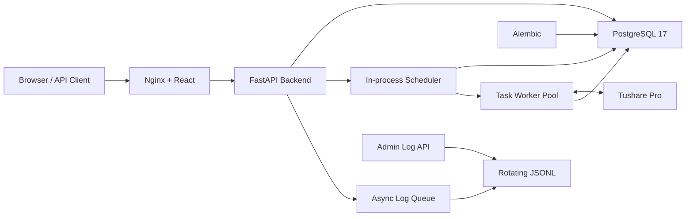

<div align="center">

<h1>Quant Foundry</h1>

<p><strong>A reliable full-stack service foundation for quantitative applications</strong></p>

<p>
Admin UI, APIs, persistence, observability, and self-hosting in one clear, verifiable,
and maintainable service foundation.
</p>

<p>
  <a href="./backend/pyproject.toml"></a>
  <a href="./frontend/package.json"></a>
  <a href="https://fastapi.tiangolo.com/"></a>
  <a href="./compose.yaml"></a>
  <a href="./compose.yaml"></a>
  <a href="./LICENSE"></a>
</p>

<p>
  <a href="#why-quant-foundry">Overview</a> ·
  <a href="#quick-start">Quick Start</a> ·
  <a href="#data-sources">Data Sources</a> ·
  <a href="#api">API</a> ·
  <a href="#development">Development</a> ·
  <a href="#contributing">Contributing</a>
</p>

<p><a href="./README.md">简体中文</a> | English</p>

</div>

> [!NOTE]
> Quant Foundry is in early development. Tushare Pro is the first integrated data source and can
> incrementally synchronize trading calendars through scheduled tasks. Stock, ETF, and daily-bar data,
> along with strategy research, backtesting, risk management, and trade execution, are in development.

## Why Quant Foundry?

Quantitative systems vary in their business capabilities, but they share the same operational needs:
configuration, databases, migrations, logging, and deployment. Quant Foundry provides these concerns
as a well-defined foundation so future development can focus on market data, research, backtesting,
and trading.

| Concern | Current implementation |
| --- | --- |
| Fast deployment | One `make selfhost` command builds, migrates, starts, and verifies the stack |
| Configuration safety | Strict settings validation with auto-generated 256-bit database and API secrets |
| Data evolution | SQLAlchemy session management and versioned Alembic migrations |
| Observability | Structured JSON logs, asynchronous writes, rotation, compression, and an admin query API |
| Task scheduling | In-process APScheduler, PostgreSQL-backed queue, concurrency, and overlap controls |
| Data sources | Tushare Pro integration with scheduler-driven incremental ingestion; trading calendars are available, while stock, ETF, and daily-bar data are in development |
| Admin interface | React console with token login, responsive layout, and light/dark themes |
| Runtime reliability | Frontend, Backend, and PostgreSQL health checks, volumes, and graceful shutdown |
| Behavioral verification | Backend unit tests, frontend type checking, and production builds |

## Architecture



Nginx serves the React SPA and forwards `/api`, documentation, and readiness requests to FastAPI over
the private Compose network. The backend connects to PostgreSQL through explicit settings and manages
schema changes with Alembic. Request and application events are written to rotating JSONL files. The
task scheduler runs in the same process as FastAPI: APScheduler handles due-time triggers, PostgreSQL
persists `task_runs`, and a bounded thread pool executes registered task types. Data-source tasks run
in that worker pool; the current Tushare task retrieves and persists trading-calendar data incrementally.

## Quick Start

Self-hosting is the shortest path to a working installation. Install Docker, Docker Compose v2,
and `make`, then run:

```bash
git clone https://github.com/Li2Wh1te/quant-foundry.git
cd quant-foundry
make selfhost
```

Once the stack is ready, open:

| URL | Purpose |
| --- | --- |
| [http://127.0.0.1:8080](http://127.0.0.1:8080) | Web admin console |
| [http://127.0.0.1:8080/docs](http://127.0.0.1:8080/docs) | Swagger UI |
| [http://127.0.0.1:8080/redoc](http://127.0.0.1:8080/redoc) | ReDoc |
| [http://127.0.0.1:8080/readyz](http://127.0.0.1:8080/readyz) | Database readiness check |

Only the Frontend and PostgreSQL host ports bind to `127.0.0.1`; the Backend is available only on the
private Compose network. The admin console keeps its token in the current tab's `sessionStorage`.

To allow access from other machines on the same LAN, edit the root `.env` first:

```dotenv
QF_SERVER_HOST=0.0.0.0
QF_WEB_HOST=0.0.0.0
QF_WEB_PORT=8080
```

Then run `make selfhost` and open `http://A-machine-LAN-IP:8080` from the other machine.

`make selfhost` stores the generated API token as `QF_API_TOKEN` in `.env`. Use that value with the
Swagger UI **Authorize** button or send it in the `Authorization` header:

```bash
curl -i -H "Authorization: Bearer <QF_API_TOKEN>" \
  http://127.0.0.1:8080/api/auth/verify
```

<details>
<summary><strong>What happens during the first deployment?</strong></summary>

1. Create the root `.env` from `backend/.env.example`, add the web port, and set `0600` permissions;
2. Generate a random 256-bit PostgreSQL password, API token, and cursor signing key with Python `secrets`;
3. Build separate Backend and Frontend images;
4. Create persistent volumes and start PostgreSQL;
5. Apply all Alembic migrations;
6. Start the Backend and Frontend and wait for every health check to pass.

Subsequent runs reuse the existing configuration, secrets, and persistent volumes.

</details>

## Data Sources

Tushare Pro is the first integrated data source. For self-hosting, set `QF_TUSHARE_TOKEN` in the root
`.env`, then run `make selfhost-deploy-backend` to load the changed Backend configuration. For source
runs, set the same variable in `backend/.env` and restart the Backend.

Open **Task Scheduler** in the admin console and create a schedule for the registered task type
`data.sync_trade_calendar`. Once enabled, the scheduler runs it automatically and subsequent runs
continue the synchronization incrementally. The current data-source scope is intentionally narrow:

| Dataset | Status | Ingestion behavior |
| --- | --- | --- |
| Trading calendar | Available | Tushare data can be synchronized incrementally on a configured schedule |
| Stock data | In development | — |
| ETF data | In development | — |
| Daily-bar data | In development | — |

`QF_INGESTION_REQUEST_INTERVAL_MS` sets the deployment-wide minimum interval between external data
source requests. A task-specific interval can make a task more conservative, but cannot reduce that
global limit.

## Operations

```bash
make selfhost-status   # Show container status
make selfhost-logs     # Follow PostgreSQL, Backend, and Frontend logs
make selfhost-deploy-frontend   # Build and redeploy only the Frontend
make selfhost-deploy-backend    # Build, migrate, and redeploy the Backend
make selfhost-restart-postgres  # Restart PostgreSQL and wait until healthy
make selfhost-psql     # Open psql
make selfhost-migrate  # Apply pending database migrations
make selfhost-down     # Stop the stack and preserve data
make selfhost-reset    # Delete database and log data, then redeploy
```

`selfhost-deploy-backend` stops the current Backend before applying database migrations, so the API
is briefly unavailable during deployment. If migration fails, it does not start a version that may
be incompatible with the database schema.

> [!WARNING]
> `make selfhost-reset` permanently deletes the database and log volumes managed by Docker Compose
> after confirmation.

Do not change only the password in `.env` after the database has been initialized. Doing so leaves
the configuration inconsistent with the PostgreSQL role. Change both with `ALTER ROLE`, or use
`make selfhost-reset` to reinitialize the stack when the existing data is not needed.

## API

See the generated OpenAPI documentation at `/docs` for complete request parameters and response
schemas.

All business endpoints require `Authorization: Bearer <QF_API_TOKEN>`. The `/readyz` endpoint is
intentionally unauthenticated so container orchestration can perform readiness checks. Documentation
pages and the OpenAPI schema are also public, but calls made from Swagger UI still require the token.

| Method | Path | Description |
| --- | --- | --- |
| `GET` | `/api` | Basic connectivity check |
| `GET` | `/readyz` | Execute `SELECT 1` to verify the database connection |
| `GET` | `/api/auth/verify` | Verify a Bearer Token |
| `GET` | `/api/admin/logs` | Query local structured logs |
| `POST` | `/api/admin/logs/clear` | Hide logs created before the request |
| `GET` | `/api/admin/strategies` | List strategy metadata without private source code |
| `POST` | `/api/admin/strategies` | Create a strategy and its first editable draft |
| `GET` | `/api/admin/strategies/{id}` | Read a strategy and its editable draft |
| `PATCH` | `/api/admin/strategies/{id}` | Update a strategy name or description with optimistic locking |
| `PATCH` | `/api/admin/strategies/{id}/draft` | Save a partial or complete draft with optimistic locking |
| `POST` | `/api/admin/strategies/{id}/validate` | Statically validate a draft without executing private source |
| `POST` | `/api/admin/strategies/{id}/publish` | Publish a validated immutable strategy revision |
| `GET` | `/api/admin/strategies/{id}/revisions` | List revision metadata without every private source body |
| `GET` | `/api/admin/strategies/{id}/revisions/{revision_number}` | Read one private revision source snapshot |
| `DELETE` | `/api/admin/strategies/{id}` | Archive a strategy while retaining draft and revision history |
| `GET` | `/api/admin/task-types` | List registered task types and parameter schemas |
| `GET` | `/api/admin/tasks` | List task definitions |
| `POST` | `/api/admin/tasks` | Create a task |
| `GET` | `/api/admin/tasks/{id}` | Read a task definition |
| `PATCH` | `/api/admin/tasks/{id}` | Update a task with optimistic locking |
| `POST` | `/api/admin/tasks/{id}/pause` | Pause future scheduling |
| `POST` | `/api/admin/tasks/{id}/resume` | Resume scheduling |
| `DELETE` | `/api/admin/tasks/{id}` | Archive a task and retain history |
| `POST` | `/api/admin/tasks/{id}/run` | Queue one manual execution |
| `GET` | `/api/admin/task-runs` | Query execution history and queue state |
| `GET` | `/api/admin/tasks/{id}/runs` | Query execution history for one task |
| `GET` | `/api/admin/task-runs/{id}` | Read one task-run record |

Private strategy drafts and published revision source are stored only in PostgreSQL, never in the
project checkout or image. Current validation checks Python syntax, the fixed
`run(context, parameters)` entry point, and the basic parameter-schema shape without importing or
executing private source. A strategy execution worker is a later delivery stage.

Log queries support `keyword`, `level`, `method`, `status_class`, `path`, `start_time`, and
`end_time` filters. The default window is the last 24 hours. A request may cover at most 31 days
and return at most 1,000 records. Clearing logs does not truncate active files; physical files remain
subject to the configured retention policy.

> [!IMPORTANT]
> The shared API token authenticates the caller but does not provide per-user permissions or audit
> identity. Use HTTPS and appropriate network access controls before exposing the service to an
> untrusted network. The web console uses the token directly in the browser, so do not add untrusted
> third-party scripts.

## Development

<details>
<summary><strong>Run from source</strong></summary>

### Requirements

- Python 3.12.2
- [uv](https://docs.astral.sh/uv/)
- Node.js 22
- pnpm 11
- An accessible PostgreSQL instance

The Frontend and Backend maintain independent dependency manifests and lockfiles.

```bash
git clone https://github.com/Li2Wh1te/quant-foundry.git
cd quant-foundry
cp backend/.env.example backend/.env
```

Edit `.env`, set real values for `QF_API_TOKEN`, `QF_CURSOR_SIGNING_KEY`, and
`QF_DATABASE_PASSWORD`, and make sure the configured PostgreSQL user and database exist.
Both the API token and the cursor signing key must contain at least 32 characters; the
cursor signing key is server-only and must never be shared with any client.
Then run:

```bash
cd backend
uv sync --locked
uv run alembic upgrade head
uv run python -m app
```

Start the frontend development server in another terminal:

```bash
cd frontend
pnpm install --frozen-lockfile
pnpm dev
```

Vite proxies API requests to `http://127.0.0.1:8000`. Run Backend tests and the Frontend production
build with:

```bash
cd backend && uv run python -m pytest -q tests
cd frontend && pnpm build
```

</details>

<details>
<summary><strong>Environment configuration</strong></summary>

All Backend settings use the `QF_` prefix. Source runs load `backend/.env`; the self-hosting script
creates the root `.env` from [`backend/.env.example`](./backend/.env.example) and passes it to containers.

| Setting | Description |
| --- | --- |
| `QF_ENVIRONMENT` | Runtime environment: `local`, `test`, or `production` |
| `QF_DEBUG` | Enable debug mode; this must be `false` in production |
| `QF_SERVER_HOST` / `QF_SERVER_PORT` | Backend container bind address and port; use `0.0.0.0` in containers |
| `QF_WEB_HOST` / `QF_WEB_PORT` | Host address and port published for the web console; use `0.0.0.0` for LAN access |
| `QF_API_TOKEN` | Shared Bearer Token used to authenticate API requests |
| `QF_CURSOR_SIGNING_KEY` | Server-only secret (at least 32 characters) used to HMAC-sign backtest result cursors; never share it with clients |
| `QF_DATABASE_*` | PostgreSQL host, port, user, password, and database name |
| `QF_LOG_DIR` / `QF_LOG_LEVEL` | Log directory and minimum log level |
| `QF_LOG_RETENTION_DAYS` | Retention period for rotated logs |
| `QF_LOG_QUEUE_SIZE` | Asynchronous log queue capacity |
| `QF_LOG_QUERY_MAX_FILES` | Maximum number of files scanned by one log query |
| `QF_SCHEDULER_ENABLED` | Enable the in-process scheduler |
| `QF_SCHEDULER_MAX_WORKERS` | Global task worker pool size |
| `QF_SCHEDULER_DISPATCH_INTERVAL_MS` | Queue dispatch interval in milliseconds |
| `QF_SCHEDULER_MAX_QUEUED_RUNS` | Global maximum number of queued runs |
| `QF_SCHEDULER_MISFIRE_GRACE_SECONDS` | Grace period for missed schedules |
| `QF_TUSHARE_TOKEN` | Tushare Pro token required by Tushare data-source tasks |
| `QF_TUSHARE_API_URL` | Tushare SDK request URL; defaults to `http://api.tushare.pro` |
| `QF_INGESTION_REQUEST_INTERVAL_MS` | Global minimum interval between external data source requests in milliseconds |

Do not commit `.env` or any real credentials.

`QF_SERVER_PORT` is propagated to the Frontend Nginx Backend proxy and health check. The Backend is
not published to the host; LAN clients should use `QF_WEB_HOST:QF_WEB_PORT`.

Note: `QF_SERVER_HOST` is the bind address inside the container and should be `0.0.0.0` for
container deployment. Do not set it to the host machine's LAN IP; LAN binding is controlled by
`QF_WEB_HOST`.

After editing the root `.env`, run `make selfhost` to reload the configuration and recreate affected
containers. For a frontend-only change, use `make selfhost-deploy-frontend`; for a backend-only
change, use `make selfhost-deploy-backend`.

</details>

<details>
<summary><strong>Database migrations</strong></summary>

After adding a SQLAlchemy model, import its module from `app/models/__init__.py`, then generate and
review the migration:

```bash
cd backend
uv run alembic revision --autogenerate -m "describe the schema change"
uv run alembic upgrade head
```

Migration files are part of the codebase and should be committed with the corresponding model changes.

</details>

<details>
<summary><strong>Project structure</strong></summary>

```text
backend/                  # FastAPI, Alembic, Backend tests, and production image
├── app/                  # Application code
│   ├── data_ingestion/   # Data-source clients, persistence, checkpoints, and scheduled tasks
│   ├── scheduling/       # Persistent scheduling, queue, and task execution
├── tests/                # Backend unit tests
├── pyproject.toml
└── Dockerfile
frontend/                 # React, Vite, Nginx configuration, and production image
├── src/                  # Pages, components, authentication state, and styles
├── nginx/                # Same-origin reverse proxy configuration
├── package.json
└── Dockerfile
scripts/                  # Self-hosting and environment initialization scripts
tests/                    # Deployment script tests
compose.yaml              # Frontend, Backend, and PostgreSQL orchestration
Makefile                  # Common self-hosting commands
```

</details>

## FAQ

<details>
<summary><strong>Is this a ready-to-use quantitative trading platform?</strong></summary>

No. The current version provides backend infrastructure and Tushare-based incremental trading-calendar
synchronization. Stock, ETF, and daily-bar data are still in development, as are the strategy engine,
backtesting, risk management, and order execution. The project status will be updated as these domain
capabilities are implemented.

</details>

<details>
<summary><strong>Can I expose the service directly to the public internet?</strong></summary>

This is not recommended. Ports bind to the local host by default. The API token provides basic
authentication, but public deployment still requires TLS, network access control, token rotation,
and a trusted reverse proxy.

</details>

<details>
<summary><strong>Where is self-hosted data stored?</strong></summary>

PostgreSQL data and Backend logs are stored in separate persistent volumes managed by Docker Compose.
`make selfhost-down` preserves these volumes; `make selfhost-reset` deletes them after confirmation.

</details>

## Contributing

Issues with reproducible bug reports and focused design discussions are welcome, as are Pull Requests.
Before submitting code:

1. Create a focused branch from the latest `main`;
2. Add or update tests for behavioral changes;
3. Run the Backend tests and `pnpm build` and confirm that both pass;
4. Explain the problem, implementation, verification, and compatibility impact in the Pull Request.

For larger changes to public APIs, data models, or deployment behavior, open an Issue first to align
on goals and scope.

## License

This project is licensed under the [Apache License 2.0](./LICENSE).

Copyright 2026 Quant Foundry contributors.
