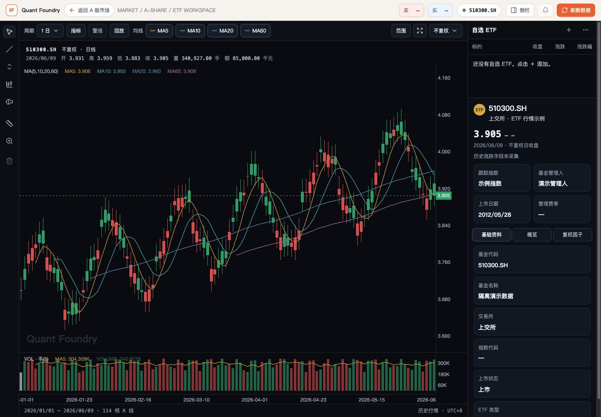
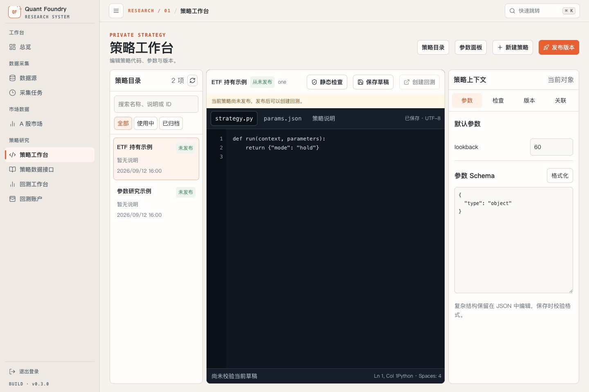
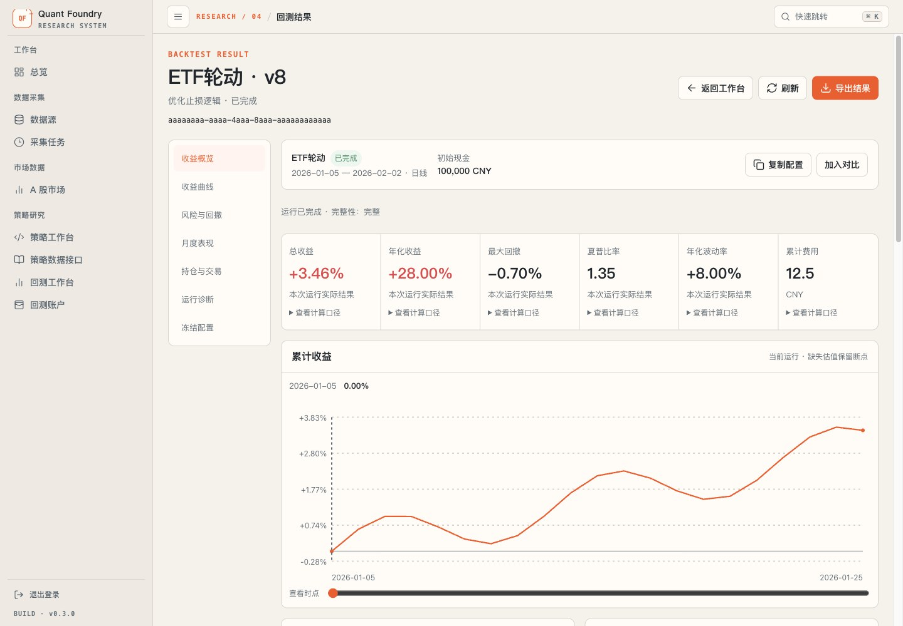
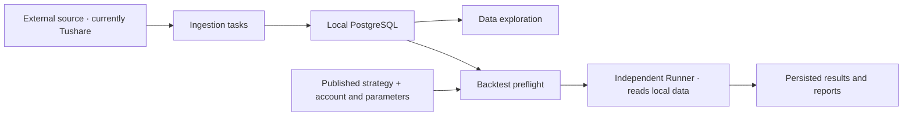
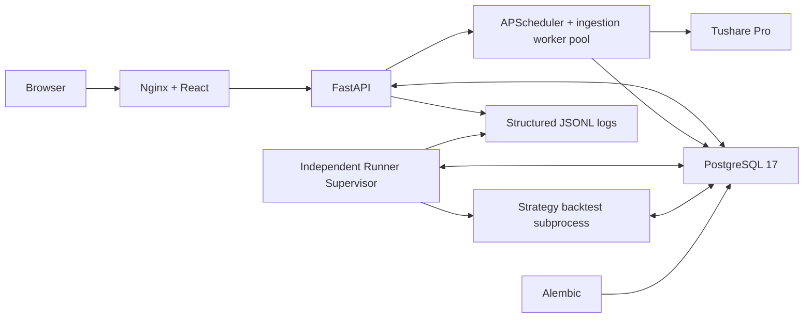

<div align="center">

<h1>Quant Foundry</h1>

<p><strong>A self-hosted quantitative research workbench for individual developers</strong></p>

<p>Connect data, investment ideas, and strategy validation so individual investors can conduct systematic research.</p>

<p>
  <a href="./LICENSE"></a>
  <a href="./compose.yaml"></a>
  <a href="./backend/pyproject.toml"></a>
  <a href="./frontend/package.json"></a>
</p>

<p>
  <a href="#why-this-project">Mission</a> ·
  <a href="#screenshots">Screenshots</a> ·
  <a href="#what-you-can-do-today">Capabilities</a> ·
  <a href="#quick-start">Quick Start</a> ·
  <a href="#your-first-local-backtest">First Backtest</a> ·
  <a href="#roadmap">Roadmap</a> ·
  <a href="#development-and-operations">Development &amp; Operations</a>
</p>

<p><a href="./README.md">简体中文</a> | English</p>

</div>

> [!NOTE]
> Quant Foundry is in early development. It currently integrates Tushare Pro and provides ETF data
> management, a Python strategy workbench, and local daily ETF backtesting. Tonghuashun connection
> management is available; its ingestion tasks are not implemented yet. A-share stocks, futures,
> paper trading, risk controls, and live execution are planned.
> This README describes its code branch; consult the matching README when using an older version.

## Why this project

Individual investors should be able to use quantitative tools to turn investment ideas into research
that can be inspected, tested, and improved. Quant Foundry aims to lower that barrier and gradually
narrow the gap between individuals and professional institutions in research tools and methods.

We are starting with an open-source, self-hosted workbench: collect and manage data, write strategies,
test hypotheses against historical observations, and review results through reports and run records.
Your data, private strategy source, and research results stay in your own deployment. The project code
is open so you can understand the implementation, extend it, and contribute.

The current audience is individual quantitative developers with Python knowledge who are comfortable
self-hosting. The long-term goal is to support a broader range of individual investors, multiple data
sources and asset classes, and eventually paper trading, risk controls, and live execution. ETFs are
the starting point of the implementation.

## v0.3.0

This release unifies workspace layouts, typography, controls, and creation flows, and extends the research workflow:

- Configure encrypted data-source credentials in the UI and inspect ingestion tasks and coverage.
- Name published strategy revisions, search instruments by name or code, and create checked backtests in a stepped Drawer.
- Explore dedicated result pages, positions, fills, and diagnostics; export all paginated results as JSON.
- Compare 2–10 completed runs and persist comparison names, run order, and reference runs on the server.
- Permanently delete unpublished, unreferenced strategies and unreferenced accounts; preserve historical objects through archiving or retirement.

See the [CHANGELOG](./CHANGELOG.md) and [v0.3.0 Release](https://github.com/Li2Wh1te/quant-foundry/releases/tag/v0.3.0).

## Screenshots

**ETF market data:** browse locally stored daily bars and switch between daily, weekly, monthly, and
yearly candles, moving averages, and adjusted chart views. The screenshot shows the new workspace with isolated, generated example bars, not actual market data.



<details>
<summary><strong>Strategy workbench and backtest analysis</strong></summary>

**Strategy workbench:** edit Python drafts, maintain parameters, and manage immutable published
revisions. This screenshot comes from a local demo using only the repository's public `hold` template
and sample records.



**Backtest analysis:** explore returns, drawdown, monthly performance, positions, fills, and diagnostics
in a dedicated result page. This screenshot uses isolated UI test fixtures to demonstrate layout and
interaction; it does not represent an actual engine run or investment performance.



</details>

## What you can do today

| Area | Implemented capabilities |
| --- | --- |
| Data ingestion | Tushare trading calendars, ETF reference data, daily bars, adjustment factors, cash dividends, and suspension/trading status; full, incremental, or recent reconciliation workflows depending on task type |
| Data exploration | ETF search and filters, persistent watchlists, reference details, candles and moving averages, forward/backward adjusted charts, adjustment-factor records, calendar coverage, and synchronization status |
| Strategy management | Python source and parameter editing, draft saving, static validation, named immutable revisions, history, archiving, and safe deletion of unpublished strategies; private source is stored in PostgreSQL |
| Accounts and execution configuration | Backtest accounts, fee schedules and their versions, usage history and safe deletion, initial cash and positions, slippage models, and execution component selection |
| Local backtesting | Bind a published strategy and fixed instruments, check local data and configuration, queue runs, inspect progress, cancel, rerun, and investigate failures |
| Result analysis | Equity and drawdown, cash and market value, performance and fee metrics, position and fill details, server-saved run comparisons, configuration differences, data evidence, and JSON export |
| Tasks and operations | Persistent ingestion scheduling, manual execution and history, a consistent workspace UI, structured service logs, and Docker Compose self-hosting |

### Ingest first, then backtest locally



**Backtests use data already stored in the local database. Fetching market data from remote sources
during a backtest is not supported.** Source credentials belong to the ingestion stage. After adding
or repairing data, check coverage and rerun preflight.

### Current boundaries

- Formal backtesting currently supports **ETFs, daily frequency, fixed instruments, and raw prices**.
  Dynamic instrument selection is not yet available.
- Charts support forward/backward adjustment; adjusted research prices are not yet enabled for formal
  backtests. Chart controls do not define backtest support.
- Preflight checks coverage, calendars, instrument identity, rules, and temporal evidence. Current
  daily bars are not strictly point-in-time (PIT) data: follow the report's degradation confirmation
  or blocking requirements. Missing evidence in other areas can also prevent a run.
- Static strategy validation checks syntax, the entry point, and parameter contracts. Actual execution
  happens during backtesting. The default `hold` template does not initiate trades.
- Some metrics depend on available data and conventions. For example, the PIT daily risk-free-rate
  Sharpe variant is unavailable when that rate series is missing.
- A-share stock daily bars, futures, paper trading, live execution, and a complete risk-control workflow
  are not yet provided.

## Quick start

### 1. Start your workbench

Install Git, Docker, Docker Compose v2, and `make`. Keep Docker running and allow network access to pull
images and install build dependencies. Self-hosting does not require Python or Node.js on the host.

```bash
git clone --branch v0.3.0 https://github.com/Li2Wh1te/quant-foundry.git
cd quant-foundry
make selfhost
```

The command initializes the root `.env`, builds images, starts PostgreSQL, applies migrations, and
starts Backend, the independent Runner, and Frontend. Existing deployments reuse their volumes,
preserve valid credentials and configured values, and receive template defaults for missing settings.

### 2. Sign in

Open [http://127.0.0.1:8080](http://127.0.0.1:8080). Copy the value of `QF_API_TOKEN` from the root `.env`
into the login page's **API Token** field. This credential grants workbench access; it serves a different
purpose from the Tushare token configured on the Data Sources page.

**Success check:** you can enter the console and open **策略工作台 (Strategy Workbench)**. Empty data
lists are expected on a fresh deployment. The current interface uses Chinese labels; this guide includes
them so the instructions match what you see.

### 3. Publish your first strategy

Open **策略工作台 → 新建策略 (New Strategy)**, enter a name, and keep the default Python template,
empty parameter schema, and default parameters. Choose **创建并进入编辑器 (Create and Open Editor)**, then
**保存草稿 → 静态检查 → 发布版本 (Save Draft → Static Check → Publish Revision)**.
Give the revision an alias describing the change so it is recognizable when selecting a backtest version.

The default strategy's core behavior is:

```python
def run(context, parameters):
    """Keep the current portfolio without submitting a new trading intent."""
    return {"mode": "hold"}
```

**Success check:** the strategy has a published revision and offers an entry to its backtest workspace.
This step needs no source token. It exercises editing and publishing without automatically downloading
market data or generating trades.

## Your first local backtest

### 1. Configure ingestion credentials

Open **数据源 (Data Sources)**, select Tushare, and configure its API URL and token. Testing validates
the form; saving validates it before replacing the stored settings. Leave an existing token blank to retain it.
The page never displays the stored token.

`make selfhost` supplies a missing `QF_DATA_SOURCE_ENCRYPTION_KEY`. On first startup, legacy Tushare
settings are migrated from environment variables into the database without changing the original file.
Later environment changes do not overwrite UI-managed settings. Back up the encryption key with the
database and retain it once encrypted credentials exist. Source-only deployments must configure a
64-character random hexadecimal key and apply migrations themselves.

Your Tushare account also needs access to the relevant endpoints. Having a token, endpoint permissions,
and adequate local data coverage are separate prerequisites. The project does not include a data-source
account or a ready-to-run offline market-data bundle.

Tonghuashun (同花顺) has independent API URL (default `https://fuyao.aicubes.cn`) and API Key
settings on the same page, using the existing encrypted database storage without additional
environment credentials. Apply database migrations and restart the service when upgrading.
Its connection test reads one ETF catalog entry; this does not prove access to all endpoints or
local data coverage. Tonghuashun has no ingestion tasks yet and cannot supply local backtest bars.
The authenticated `GET /api/data-sources/tonghuashun/interfaces` endpoint lists 94 documented
interfaces, explicitly marked as unverified and without ingestion adapters; listing them does
not start collection.

### 2. Ingest and inspect local data

Create tasks in **采集任务 (Ingestion Tasks)** in the order below. Select task types by their displayed
Chinese/English names. You can run a task manually after creation and configure future incremental runs.

| Order | Task type | What to check afterward |
| --- | --- | --- |
| 1 | 交易日历采集（Sync Tushare trade calendar） | Configure each required exchange, such as `SSE` and `SZSE`, with a start date covering research and warmup; inspect coverage in 交易日历 (Trading Calendar) |
| 2 | ETF基础信息采集（Sync Tushare ETF basics） | Find the target ETF in A 股市场 (A-share Market), in the ETF list and inspect its details |
| 3 | ETF日线全量采集（Full Tushare ETF daily bars） | Establish history, inspect the actual date range in the ETF market-detail workspace, then schedule incremental daily-bar ingestion |
| 4 | 停牌交易状态采集（Trading status and suspension ingestion）、ETF现金分红全量采集（Full Tushare ETF cash dividends） | Fill the applicable instrument/date coverage, check run records, and use backtest preflight to determine whether the evidence is sufficient |

For the first historical trading-status collection, explicitly set `start_date` and `end_date` to cover
the backtest and warmup windows; an initial run without a date range only collects the current day.
`coverage_confirmed` defaults to false. Enable it only after independently confirming that the source
query covers the requested interval and the response is complete; a successful task alone does not
establish complete coverage evidence.

For adjusted charts, also run **ETF复权因子全量采集（Full Tushare ETF adjustment factors）** and schedule
incremental ingestion and recent reconciliation as needed. Stored factors do not enable adjusted prices
in formal backtests.

Full daily-bar ingestion derives its starting range from ETF reference data and can take time on the
first run. Confirm that ingestion succeeded and data is stored before choosing a fully covered backtest
window. Creating a schedule or seeing a chart alone does not establish backtest readiness.

### 3. Prepare the strategy, account, and instruments

- Select a published revision in **策略工作台 (Strategy Workbench)**. Start with `hold` to exercise the
  workflow. To generate trades, consult **策略数据接口 (Strategy Data Interface)** and the
  [strategy protocol implementation](./backend/app/strategy_protocol/), then validate and publish your strategy.
- Create an available account in **回测账户 (Backtest Accounts)**, configure the fee schedule and rules,
  save it, and select its corresponding version in the backtest workspace.
- Search and select ETFs by name or code in **固定标的范围 (Fixed Instruments)**. Initial positions use
  the same searchable selector. The system resolves UUIDs; you do not enter them manually. Missing
  identity mappings must be repaired before proceeding, and preflight remains authoritative.

### 4. Check and run

Open **回测工作台 → 创建回测 (Backtest Workspace → Create Backtest)**, or enter from a strategy:

1. **策略与版本 (Strategy and Revision):** select a published version by number and alias and set parameters.
2. **账户与执行配置 (Account and Execution):** select an account version, dates, cash, instruments,
   exchange calendars, slippage, warmup sessions, and initial positions. Dates cannot be in the future; start with raw prices.
3. **运行检查与确认 (Check and Confirm):** click **检查当前配置 (Check Current Configuration)**.
   Resolve missing data, account, or rule issues. Review and confirm permitted degradations; resolve
   blockers before continuing. Every configuration change requires a fresh check. Then click **创建回测 (Create Backtest)**.

The independent Runner executes against the local database. Open **完整结果 (Full Results)** to inspect
metrics, curves, details, and diagnostics. Copy configuration for another run, export JSON, or add the
run to a comparison and save the comparison on the server.

**Success check:** inspect the run status, result integrity, and result page. A successful empty `hold`
example may have no fills and a flat curve. Use diagnostics, preflight evidence, and `make selfhost-logs`
to investigate failures.

## Roadmap

These are development directions, not promised dates or a fixed delivery sequence.

| Direction | Current state | Planned work |
| --- | --- | --- |
| Data sources | Tushare ETF/calendar ingestion; Tonghuashun connection management, interface catalog and REST transport | Add Tonghuashun ingestion adapters in stages and expand multi-source coverage |
| Asset coverage | ETF data management and daily backtesting are implemented | Add A-share stocks, futures, and their corresponding data and trading rules |
| Research and backtesting | Strategy revisions, preflight, fixed-instrument runs, and result analysis are implemented | Improve data quality, adjusted research prices, dynamic instruments, and research capabilities |
| Paper trading | Planned | Validate continuously running strategies and trading workflows |
| Risk controls | Planned | Build controls for paper and live trading |
| Live execution | Planned | Integrate execution venues, actual orders, and operational management |
| Usability | Python knowledge and self-hosting skills are currently required | Lower research and operational barriers for a broader range of individual investors |

Use [Issues](https://github.com/Li2Wh1te/quant-foundry/issues) to discuss use cases, data requirements,
and design tradeoffs.

## Upgrade from an older version

Back up PostgreSQL and the root `.env`, including the data-source encryption key. Retain existing
configuration and volumes. In your deployment checkout, run:

```bash
git fetch origin --tags
git checkout v0.3.0
make selfhost
```

Preserve local code changes first. This builds both services, applies migrations, and updates Runner.
Upgrade the complete stack: a frontend/backend version mismatch blocks login. Refresh the browser
and check service status afterward.

Legacy Tushare environment settings migrate into the database on first startup; maintain them through
**数据源 (Data Sources)** afterward. Keep `QF_DATA_SOURCE_ENCRYPTION_KEY` with the database.
This release removes the operational-log, standalone daily-quote, and API-documentation navigation
entries, the `/api/admin/logs`, `/api/admin/logs/clear`, and sample `/api` endpoints, and support for
`QF_LOG_QUERY_MAX_FILES`. ETF market queries, structured log writing, and developer documentation
at `/docs` and `/redoc` remain available.

## Development and operations

<details>
<summary><strong>Architecture and project structure</strong></summary>



Frontend proxies `/api`, API documentation, and readiness requests over the private Compose network.
The scheduler inside Backend manages persistent ingestion tasks and queuing. The independent Runner
supervises backtest execution with separate concurrency and resource settings. PostgreSQL stores
collected data, strategies, account versions, run configurations, and results. Rotating JSONL logs use
a persistent volume.

```text
backend/
├── app/
│   ├── data_ingestion/     # Source clients, ingestion, checkpoints, and queries
│   ├── scheduling/         # Persistent ingestion scheduling and execution
│   ├── strategies/         # Private drafts and immutable strategy revisions
│   ├── strategy_protocol/  # Strategy entry point and data access contracts
│   ├── backtesting/        # Preflight, execution, accounting, and analysis
│   └── runner/             # Independent backtest supervision
├── tests/
└── pyproject.toml
frontend/                   # React workspace, charts, and reports
scripts/                    # Self-hosting and release tooling
tests/                      # Deployment script tests
compose.yaml                # Frontend, Backend, Runner, and PostgreSQL
Makefile                    # Deployment and validation commands
```

</details>

<details>
<summary><strong>Deployment commands and LAN access</strong></summary>

```bash
make selfhost-status            # Show service status
make selfhost-logs              # Follow service logs, including Runner
make selfhost-deploy-frontend   # Build and redeploy Frontend
make selfhost-deploy-backend    # Build, migrate, and redeploy Backend and Runner
make selfhost-restart-postgres  # Restart PostgreSQL and wait for readiness
make selfhost-psql              # Open psql
make selfhost-migrate           # Apply pending database migrations
make selfhost-down              # Stop services and preserve data
```

`selfhost-deploy-backend` stops Backend and Runner before migrations, briefly interrupting the API.
If migration fails, the script stops; fix the cause before redeploying. Back up important data before
upgrades: migrations do not automatically create backups.

By default, published Web and PostgreSQL host ports bind only to `127.0.0.1`. Backend does not publish
a host port. For LAN access, set the following in the root `.env`:

```dotenv
QF_SERVER_HOST=0.0.0.0
QF_WEB_HOST=0.0.0.0
QF_WEB_PORT=8080
```

Run `make selfhost`, then access `http://<deployment-machine-LAN-IP>:8080`. `QF_SERVER_HOST` controls
Backend's listener inside the container; `QF_WEB_HOST` controls the host-side Web binding.

`make selfhost-reset` asks for confirmation, permanently deletes the database and log volumes managed
by Compose, and redeploys. Changing an initialized database password requires updating both the
PostgreSQL role and `.env`, not just the configuration file.

</details>

<details>
<summary><strong>Environment configuration</strong></summary>

See [`backend/.env.example`](./backend/.env.example) for all settings and defaults. Self-hosting uses
the root `.env`; source development uses `backend/.env`. Relevant services must reload after changes.

| Setting | Purpose |
| --- | --- |
| `QF_API_TOKEN` | Shared Web and business API access credential |
| `QF_CURSOR_SIGNING_KEY` | Server-only signing key for backtest result cursors |
| `QF_BACKTEST_INTERNAL_TOKEN` | Internal acceptance endpoint credential; unnecessary for ordinary onboarding |
| `QF_DATA_SOURCE_ENCRYPTION_KEY` | Data-source credential encryption key; keep with the database backup |
| `QF_INGESTION_REQUEST_INTERVAL_MS` | Minimum interval between external ingestion requests; task settings can only increase it |
| `QF_DATABASE_*` | PostgreSQL connection settings |
| `QF_SERVER_*` / `QF_WEB_*` | Backend listeners and self-hosted Web addresses/ports |
| `QF_SCHEDULER_*` | Ingestion scheduler enablement, concurrency, queuing, and misfire settings |
| `QF_BACKTEST_*` | Independent Runner concurrency, queue, timeout, memory, heartbeat, and progress persistence settings |
| `QF_LOG_*` | Log directory, level, retention, and queue capacity |
| `QF_ENVIRONMENT` / `QF_DEBUG` | Environment and debugging settings |

Self-hosted initialization generates deployment secrets when missing or known to be invalid, and sets
`.env` permissions to `0600`. Subsequent upgrades preserve valid existing values and add missing settings.
Users supply their own source tokens. Do not commit `.env` or include server-only secrets in screenshots.

</details>

<details>
<summary><strong>Source development and validation</strong></summary>

Install Python 3.12.2, uv, Node.js 22, pnpm 11.19.0, and an accessible PostgreSQL instance. From the
repository root:

```bash
cp backend/.env.example backend/.env
```

Edit `backend/.env`: set `QF_API_TOKEN`, `QF_CURSOR_SIGNING_KEY`, and the database connection settings.
The PostgreSQL user and database must already exist. Both access/signing keys need at least 32 characters.
If you are not using internal acceptance endpoints, remove the empty `QF_BACKTEST_INTERNAL_TOKEN=` line
or give it a separate valid credential.

In the Backend terminal:

```bash
cd backend
uv sync --locked
uv run alembic upgrade head
uv run python -m app
```

In a separate Runner terminal:

```bash
cd backend
uv run python -m app.runner
```

In a separate Frontend terminal:

```bash
cd frontend
pnpm install --frozen-lockfile
pnpm dev
```

Vite proxies API requests to `http://127.0.0.1:8000` by default. Source-based backtesting requires both
Backend and Runner; `make selfhost` starts both automatically.

Run standard validation from the repository root:

```bash
make release-check
make test
cd frontend && pnpm test
```

`make test` runs deployment script tests, backend tests, and frontend type checking/production build.
See the [Validate workflow](./.github/workflows/validate.yml) for full CI configuration, including
PostgreSQL migrations and acceptance tests. Use a dedicated test database for database acceptance runs.

Import new database models in `backend/app/models/__init__.py`, generate and inspect the Alembic
migration, and apply it with `uv run alembic upgrade head`. Commit model changes with their migrations.

</details>

<details>
<summary><strong>API and authentication</strong></summary>

After deployment, [Swagger UI](http://127.0.0.1:8080/docs) and [ReDoc](http://127.0.0.1:8080/redoc)
provide full parameters, response schemas, and interactive API exploration.

| API area | Capabilities |
| --- | --- |
| Authentication and version | Validate an access token and query the deployed version |
| Data queries | Read locally stored trading calendars, ETF reference data, daily bars, and adjustment factors |
| Strategies | Manage drafts, static validation, revision aliases, publishing, archiving, and safe deletion |
| Backtest accounts and configuration | Manage account/fee versions and query available execution components |
| Backtest runs and results | Preflight, create, inspect, cancel, rerun, view report details, and manage saved comparisons |
| Ingestion scheduling | Task types, schedules, execution history, and status counts |

Business APIs use `Authorization: Bearer <QF_API_TOKEN>`:

```bash
curl -i -H "Authorization: Bearer <QF_API_TOKEN>" \
  http://127.0.0.1:8080/api/auth/verify
```

`/readyz` and API documentation pages are unauthenticated. Business API calls from Swagger still require
authorization. The shared token does not provide per-user permission isolation; Web stores it in the
current tab's `sessionStorage`. Internet-facing deployments require additional HTTPS, network access
controls, and credential management.

</details>

## FAQ

<details>
<summary><strong>Can I try it without a data-source token?</strong></summary>

You can start the services, sign in, create and publish strategies, and configure accounts and tasks.
Market-data exploration and backtests on real data require ingestion first. The synthetic report
screenshot comes from project tests; the product does not currently offer a selectable offline demo mode.

</details>

<details>
<summary><strong>Why does preflight block a run when I can already see candles?</strong></summary>

Candles only establish that some market data is present. Backtests also require applicable calendars,
instrument identity, trading rules, status, and corporate-action evidence for the selected and warmup
windows. Follow the current preflight report to fill gaps or adjust configuration; blocking requirements
cannot be skipped.

</details>

<details>
<summary><strong>Where are my data and private strategies stored?</strong></summary>

Collected data, private strategy drafts and revisions, accounts, and backtest results reside in your
deployment's PostgreSQL database. Strategy source is not written to the project directory or images.
Docker Compose uses persistent volumes: `make selfhost-down` preserves them, while `make selfhost-reset`
deletes them. Database persistence is not an automatic backup.

</details>

## Contributing

Open an [Issue](https://github.com/Li2Wh1te/quant-foundry/issues) to report a problem, describe a use case,
or discuss the roadmap. Pull Requests improving ingestion, research capabilities, the interface, and
documentation are welcome. Discuss major changes to public APIs, data models, or deployment first.

1. Create a focused development branch from the latest `main`; avoid developing directly on `main`.
2. Add appropriate tests for behavior changes and complete relevant local validation.
3. Merge the latest `origin/main` before pushing, resolve conflicts, and rerun validation.
4. Describe the problem, changes, validation, and compatibility impact in the PR, then merge after the
   required CI checks pass.

## License

Licensed under the [Apache License 2.0](./LICENSE).

Copyright 2026 Quant Foundry contributors.
