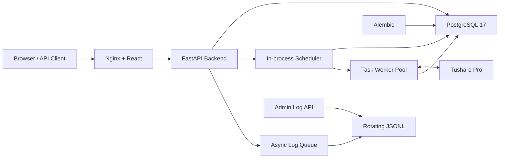

<div align="center">

<h1>Quant Foundry</h1>

<p><strong>为量化应用准备的可靠全栈服务底座</strong></p>

<p>
从管理控制台、API、数据持久化到可观测性与自托管，提供一套清晰、可验证、可持续演进的服务基础设施。
</p>

<p>
  <a href="./backend/pyproject.toml"></a>
  <a href="./frontend/package.json"></a>
  <a href="https://fastapi.tiangolo.com/"></a>
  <a href="./compose.yaml"></a>
  <a href="./compose.yaml"></a>
  <a href="./LICENSE"></a>
</p>

<p>
  <a href="#为什么选择-quant-foundry">项目定位</a> ·
  <a href="#快速开始">快速开始</a> ·
  <a href="#数据源">数据源</a> ·
  <a href="#api">API</a> ·
  <a href="#开发指南">开发指南</a> ·
  <a href="#参与贡献">参与贡献</a>
</p>

<p><a href="./README.md">English</a> | 简体中文</p>

</div>

> [!NOTE]
> Quant Foundry 目前处于早期开发阶段，Tushare Pro 已作为首个数据源接入，配置后可通过计划任务
> 增量同步交易日历；股票、ETF、日线数据，以及策略研究、回测、风控和交易执行能力仍在开发中。

## 为什么选择 Quant Foundry？

量化系统的业务能力各不相同，但可靠运行所需的配置、数据库、迁移、日志和部署能力高度
相似。Quant Foundry 将这些通用问题沉淀为一个边界清晰的基础项目，让后续开发可以聚焦
于行情、研究、回测与交易领域本身。

| 关注点 | 当前实现 |
| --- | --- |
| 快速部署 | 一条 `make selfhost` 命令完成构建、迁移、启动和就绪检查 |
| 配置安全 | Settings 严格校验，首次部署自动生成 256-bit 数据库密码和 API Token |
| 数据演进 | SQLAlchemy 会话管理与 Alembic 版本化迁移 |
| 可观测性 | JSON 结构化日志、异步写入、轮转压缩和管理查询 API |
| 任务调度 | FastAPI 进程内 APScheduler、PostgreSQL 持久化队列、并发与排队控制 |
| 数据源 | 已接入 Tushare Pro，通过调度器执行增量同步；当前支持交易日历，股票、ETF 与日线数据开发中 |
| 管理界面 | React 管理台、Token 登录、响应式布局和深浅主题 |
| 运行可靠性 | 前端、后端与 PostgreSQL 健康检查、持久化卷和优雅停止 |
| 行为验证 | 后端单元测试、前端类型检查和生产构建 |

## 架构概览



Nginx 提供 React 单页应用，并通过 Compose 私有网络将 `/api`、API 文档和就绪检查请求
转发给 FastAPI。后端通过显式配置连接 PostgreSQL，通过 Alembic 管理模式变更；请求和
应用事件进入异步日志队列后写入按天轮转的 JSONL 文件。任务调度器与 FastAPI 使用同一进程，
APScheduler 负责到点触发，PostgreSQL 中的 `task_runs` 负责持久化排队状态，受限线程池负责
执行注册的任务类型。数据源任务同样在该线程池中执行；当前 Tushare 任务会增量拉取并持久化
交易日历数据。

## 快速开始

自托管是体验项目的最短路径。请先准备 Docker、Docker Compose v2 和 `make`：

```bash
git clone https://github.com/Li2Wh1te/quant-foundry.git
cd quant-foundry
make selfhost
```

启动完成后可以访问：

| 地址 | 用途 |
| --- | --- |
| [http://127.0.0.1:8080](http://127.0.0.1:8080) | Web 管理台 |
| [http://127.0.0.1:8080/docs](http://127.0.0.1:8080/docs) | Swagger UI |
| [http://127.0.0.1:8080/redoc](http://127.0.0.1:8080/redoc) | ReDoc |
| [http://127.0.0.1:8080/readyz](http://127.0.0.1:8080/readyz) | 数据库就绪检查 |

只有前端和 PostgreSQL 的宿主机端口默认绑定到 `127.0.0.1`；后端仅在 Compose 私有
网络中提供服务。Web 管理台登录后会把 Token 保存在当前标签页的 `sessionStorage` 中。

如果需要让同一局域网内的其他机器访问，请先修改根目录 `.env`：

```dotenv
QF_SERVER_HOST=0.0.0.0
QF_WEB_HOST=0.0.0.0
QF_WEB_PORT=8080
```

然后执行 `make selfhost`，在其他机器访问 `http://A机器的局域网IP:8080`。

`make selfhost` 会将生成的 API Token 以 `QF_API_TOKEN` 写入 `.env`。可以把该值填入
Swagger UI 的 **Authorize** 对话框，也可以通过 `Authorization` 请求头调用接口：

```bash
curl -i -H "Authorization: Bearer <QF_API_TOKEN>" \
  http://127.0.0.1:8080/api/auth/verify
```

<details>
<summary><strong>首次部署具体做了什么？</strong></summary>

1. 从 `backend/.env.example` 创建权限为 `0600` 的根目录 `.env`，并补充 Web 端口；
2. 使用 Python `secrets` 生成 256-bit PostgreSQL 随机密码和 API Token；
3. 分别构建 Backend 和 Frontend 镜像；
4. 创建持久化数据卷并启动 PostgreSQL；
5. 执行全部 Alembic 迁移；
6. 启动 Backend 和 Frontend，并等待所有健康检查通过。

再次执行会复用已有的配置、密钥和持久化数据卷。

</details>

## 数据源

Tushare Pro 是当前已接入的首个数据源。自托管部署时，请在根目录 `.env` 中设置
`QF_TUSHARE_TOKEN`，然后执行 `make selfhost-deploy-backend` 使 Backend 读取新配置。源码运行时，
请在 `backend/.env` 中设置同名变量并重启 Backend。

进入管理台的 **任务调度**，为已注册任务类型 `data.sync_trade_calendar` 创建计划。启用后，
调度器会自动执行，后续运行将继续增量同步。当前数据源能力刻意保持在较小范围内：

| 数据集 | 状态 | 同步方式 |
| --- | --- | --- |
| 交易日历 | 已支持 | 按配置的计划从 Tushare 增量同步 |
| 股票数据 | 开发中 | — |
| ETF 数据 | 开发中 | — |
| 日线数据 | 开发中 | — |

`QF_INGESTION_REQUEST_INTERVAL_MS` 定义部署级别的外部数据源请求最小间隔。任务级间隔可以设置得
更保守，但不能低于该全局限制。

## 日常运维

```bash
make selfhost-status   # 查看容器状态
make selfhost-logs     # 跟踪 PostgreSQL、Backend 和 Frontend 日志
make selfhost-deploy-frontend   # 仅构建并重新部署 Frontend
make selfhost-deploy-backend    # 构建、迁移并重新部署 Backend
make selfhost-restart-postgres  # 重启 PostgreSQL 并等待恢复健康
make selfhost-psql     # 打开 psql
make selfhost-migrate  # 执行待处理的数据库迁移
make selfhost-down     # 停止服务并保留数据
make selfhost-reset    # 删除数据库和日志数据，然后重新部署
```

`selfhost-deploy-backend` 会在运行数据库迁移前停止旧 Backend，因此部署期间 API 会短暂
不可用；迁移失败时不会启动可能与数据库结构不匹配的新版本。

> [!WARNING]
> `make selfhost-reset` 会在确认后永久删除 Compose 管理的数据库和日志卷。

数据库初始化后，不要只修改 `.env` 中的密码，否则配置会与 PostgreSQL 内部账号不一致。
需要变更密码时，请同时执行 `ALTER ROLE`；如果不需要保留数据，也可以使用
`make selfhost-reset` 重新初始化。

## API

完整请求参数和响应结构以 `/docs` 中的 OpenAPI 文档为准。

所有业务接口都要求提供 `Authorization: Bearer <QF_API_TOKEN>`。`/readyz` 特意不鉴权，
以便容器编排执行就绪检查。文档页面和 OpenAPI Schema 也可以公开访问，但从 Swagger UI
调用实际接口时仍需提供 Token。

| 方法 | 路径 | 说明 |
| --- | --- | --- |
| `GET` | `/api` | 基础连通性检查 |
| `GET` | `/readyz` | 执行 `SELECT 1`，检查数据库连接 |
| `GET` | `/api/auth/verify` | 验证 Bearer Token |
| `GET` | `/api/admin/logs` | 查询本地结构化日志 |
| `POST` | `/api/admin/logs/clear` | 隐藏调用时刻之前的日志 |
| `GET` | `/api/admin/task-types` | 查询已注册的任务类型和参数 Schema |
| `GET` | `/api/admin/tasks` | 查询任务定义 |
| `POST` | `/api/admin/tasks` | 创建任务 |
| `GET` | `/api/admin/tasks/{id}` | 查询任务详情 |
| `PATCH` | `/api/admin/tasks/{id}` | 按版本更新任务 |
| `POST` | `/api/admin/tasks/{id}/pause` | 暂停未来调度 |
| `POST` | `/api/admin/tasks/{id}/resume` | 恢复任务调度 |
| `DELETE` | `/api/admin/tasks/{id}` | 归档任务并保留历史 |
| `POST` | `/api/admin/tasks/{id}/run` | 手动排队执行一次 |
| `GET` | `/api/admin/task-runs` | 查询执行历史和队列状态 |
| `GET` | `/api/admin/tasks/{id}/runs` | 查询单个任务的执行历史 |
| `GET` | `/api/admin/task-runs/{id}` | 查询单条任务执行记录 |

日志查询支持 `keyword`、`level`、`method`、`status_class`、`path`、`start_time`
和 `end_time` 过滤。默认查询最近 24 小时，单次时间范围最多为 31 天，最多返回
1000 条记录。清理操作不会截断正在写入的文件，物理文件仍由保留策略自动清理。

> [!IMPORTANT]
> 共享 API Token 可以验证调用方是否持有凭据，但不提供用户级权限和审计身份。将服务暴露
> 到非受信网络前，仍必须使用 HTTPS 并配置适当的网络访问控制。Web 管理台直接在浏览器
> 中使用 Token，因此不要引入不可信的第三方脚本。

## 开发指南

<details>
<summary><strong>本地源码运行</strong></summary>

### 环境要求

- Python 3.12.2
- [uv](https://docs.astral.sh/uv/)
- Node.js 22
- pnpm 11
- 可访问的 PostgreSQL

前后端分别维护自己的依赖与锁文件。

```bash
git clone https://github.com/Li2Wh1te/quant-foundry.git
cd quant-foundry
cp backend/.env.example backend/.env
```

编辑 `.env`，为 `QF_API_TOKEN` 和 `QF_DATABASE_PASSWORD` 设置真实值，并确保对应的
PostgreSQL 用户和数据库已经存在。API Token 至少需要 32 个字符。然后执行：

```bash
cd backend
uv sync --locked
uv run alembic upgrade head
uv run python -m app
```

另开终端启动前端开发服务器：

```bash
cd frontend
pnpm install --frozen-lockfile
pnpm dev
```

Vite 会将 API 请求代理到 `http://127.0.0.1:8000`。运行后端测试和前端生产构建：

```bash
cd backend && uv run python -m unittest discover -v
cd frontend && pnpm build
```

</details>

<details>
<summary><strong>环境配置</strong></summary>

所有后端配置均使用 `QF_` 前缀。源码运行时读取 `backend/.env`；自托管脚本根据
[`backend/.env.example`](./backend/.env.example) 生成根目录 `.env` 并传给容器。

| 配置 | 说明 |
| --- | --- |
| `QF_ENVIRONMENT` | 运行环境：`local`、`test` 或 `production` |
| `QF_DEBUG` | 是否启用调试模式，生产环境必须为 `false` |
| `QF_SERVER_HOST` / `QF_SERVER_PORT` | Backend 容器内监听地址和端口；容器部署时 Host 应为 `0.0.0.0` |
| `QF_WEB_HOST` / `QF_WEB_PORT` | Web 管理台发布到宿主机的地址和端口；局域网访问使用 `0.0.0.0` |
| `QF_API_TOKEN` | 用于验证 API 请求的共享 Bearer Token |
| `QF_DATABASE_*` | PostgreSQL 地址、端口、用户、密码和数据库名 |
| `QF_LOG_DIR` / `QF_LOG_LEVEL` | 日志目录和最低日志级别 |
| `QF_LOG_RETENTION_DAYS` | 轮转日志保留天数 |
| `QF_LOG_QUEUE_SIZE` | 异步日志队列容量 |
| `QF_LOG_QUERY_MAX_FILES` | 单次日志查询最多扫描的文件数 |
| `QF_SCHEDULER_ENABLED` | 是否启用进程内调度器 |
| `QF_SCHEDULER_MAX_WORKERS` | 全局任务线程池并发数 |
| `QF_SCHEDULER_DISPATCH_INTERVAL_MS` | 队列派发检查间隔（毫秒） |
| `QF_SCHEDULER_MAX_QUEUED_RUNS` | 全局最大排队执行数 |
| `QF_SCHEDULER_MISFIRE_GRACE_SECONDS` | 错过计划后的补触发宽限时间 |
| `QF_TUSHARE_TOKEN` | Tushare Pro Token；运行 Tushare 数据源任务时必填 |
| `QF_TUSHARE_API_URL` | Tushare SDK 请求地址，默认 `http://api.tushare.pro` |
| `QF_INGESTION_REQUEST_INTERVAL_MS` | 外部数据源请求的全局最小间隔（毫秒） |

不要提交 `.env` 或任何真实凭据。

`QF_SERVER_PORT` 会同步到 Frontend Nginx 的 Backend 代理和健康检查；Backend 不会直接发布
到宿主机，局域网客户端应访问 `QF_WEB_HOST:QF_WEB_PORT`。

注意：`QF_SERVER_HOST` 是容器内部监听地址，容器部署应使用 `0.0.0.0`，不要填写宿主机的
局域网 IP；局域网绑定由 `QF_WEB_HOST` 控制。

修改根目录 `.env` 后，请重新执行 `make selfhost`，脚本会重新读取配置并重建受影响的容器；
仅修改页面端口时也可以执行 `make selfhost-deploy-frontend`，仅修改 Backend 配置时可以执行
`make selfhost-deploy-backend`。

</details>

<details>
<summary><strong>数据库迁移</strong></summary>

新增 SQLAlchemy 模型后，先将模型模块导入 `app/models/__init__.py`，再生成并检查迁移：

```bash
cd backend
uv run alembic revision --autogenerate -m "describe the schema change"
uv run alembic upgrade head
```

迁移文件属于代码的一部分，应与模型变更一起提交。

</details>

<details>
<summary><strong>项目结构</strong></summary>

```text
backend/                  # FastAPI、Alembic、后端测试与生产镜像
├── app/                  # 应用代码
│   ├── data_ingestion/   # 数据源客户端、持久化、检查点与计划任务
│   ├── scheduling/       # 持久化任务调度、队列和执行器
├── tests/                # 后端单元测试
├── pyproject.toml
└── Dockerfile
frontend/                 # React、Vite、Nginx 配置与生产镜像
├── src/                  # 页面、组件、鉴权状态与样式
├── nginx/                # 同源反向代理配置
├── package.json
└── Dockerfile
scripts/                  # 自托管与环境初始化脚本
tests/                    # 部署脚本测试
compose.yaml              # Frontend、Backend 与 PostgreSQL 编排
Makefile                  # 常用自托管命令
```

</details>

## 常见问题

<details>
<summary><strong>这是一个可以直接使用的量化交易平台吗？</strong></summary>

不是。当前版本提供量化应用所需的后端基础设施，以及基于 Tushare 的交易日历增量同步。股票、
ETF 和日线数据，以及策略引擎、回测系统、风控和订单执行仍在开发中。项目状态会随着这些领域
能力落地而更新。

</details>

<details>
<summary><strong>可以直接暴露到公网吗？</strong></summary>

不建议。默认端口仅绑定本机。API Token 提供了基础身份认证，但公网部署仍需配置 TLS、
网络访问控制、Token 轮换机制和可信反向代理。

</details>

<details>
<summary><strong>自托管数据保存在哪里？</strong></summary>

PostgreSQL 数据和 Backend 日志分别保存在 Docker Compose 管理的持久化卷中。
`make selfhost-down` 会保留这些数据，`make selfhost-reset` 会在确认后删除它们。

</details>

## 参与贡献

欢迎通过 Issue 报告可复现的问题或讨论设计方案，也欢迎提交 Pull Request。提交代码前请：

1. 从最新的 `main` 创建范围清晰的分支；
2. 为行为变更补充或更新测试；
3. 运行后端测试和 `pnpm build` 并确认通过；
4. 在 Pull Request 中说明问题、实现方案、验证结果和兼容性影响。

对于影响公共 API、数据模型或部署方式的较大改动，建议先通过 Issue 对齐目标和边界。

## 许可证

本项目采用 [Apache License 2.0](./LICENSE) 开源许可证。

Copyright 2026 Quant Foundry contributors.
