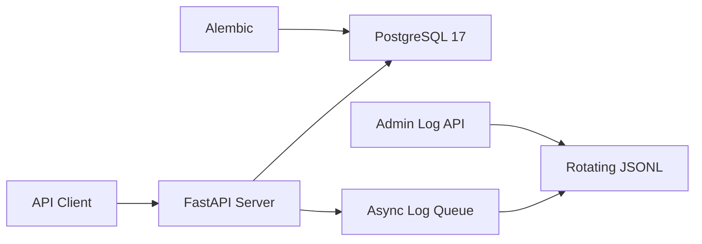

<div align="center">

<h1>Quant Foundry</h1>

<p><strong>为量化应用准备的可靠 FastAPI 后端底座</strong></p>

<p>
从配置、数据持久化到可观测性与自托管，提供一套清晰、可验证、可持续演进的服务基础设施。
</p>

<p>
  <a href="./pyproject.toml"></a>
  <a href="https://fastapi.tiangolo.com/"></a>
  <a href="./compose.yaml"></a>
  <a href="./compose.yaml"></a>
  <a href="./LICENSE"></a>
</p>

<p>
  <a href="#为什么选择-quant-foundry">项目定位</a> ·
  <a href="#快速开始">快速开始</a> ·
  <a href="#api">API</a> ·
  <a href="#开发指南">开发指南</a> ·
  <a href="#参与贡献">参与贡献</a>
</p>

<p><a href="./README.md">English</a> | 简体中文</p>

</div>

> [!NOTE]
> Quant Foundry 目前处于早期开发阶段，已经具备后端服务基础设施，但尚未实现行情接入、
> 策略研究、回测或交易执行能力。

## 为什么选择 Quant Foundry？

量化系统的业务能力各不相同，但可靠运行所需的配置、数据库、迁移、日志和部署能力高度
相似。Quant Foundry 将这些通用问题沉淀为一个边界清晰的基础项目，让后续开发可以聚焦
于行情、研究、回测与交易领域本身。

| 关注点 | 当前实现 |
| --- | --- |
| 快速部署 | 一条 `make selfhost` 命令完成构建、迁移、启动和就绪检查 |
| 配置安全 | Pydantic Settings 严格校验，首次部署自动生成 256-bit 数据库密码 |
| 数据演进 | SQLAlchemy 会话管理与 Alembic 版本化迁移 |
| 可观测性 | JSON 结构化日志、异步写入、轮转压缩和管理查询 API |
| 运行可靠性 | PostgreSQL 与 Server 健康检查、持久化卷和优雅停止 |
| 行为验证 | 配置、数据库、服务和日志模块的单元测试 |

## 架构概览



应用通过显式配置连接 PostgreSQL，通过 Alembic 管理模式变更。请求和应用事件进入异步
日志队列后写入按天轮转的 JSONL 文件，管理接口从当前及历史文件中执行受限查询。

## 快速开始

自托管是体验项目的最短路径。请先准备 Docker、Docker Compose v2 和 `make`：

```bash
git clone https://github.com/Li2Wh1te/quant-foundry.git
cd quant-foundry
make selfhost
```

启动完成后可以访问：

| 地址 | 用途 |
| --- | --- |
| [http://127.0.0.1:8000](http://127.0.0.1:8000) | API 根路径 |
| [http://127.0.0.1:8000/docs](http://127.0.0.1:8000/docs) | Swagger UI |
| [http://127.0.0.1:8000/redoc](http://127.0.0.1:8000/redoc) | ReDoc |
| [http://127.0.0.1:8000/readyz](http://127.0.0.1:8000/readyz) | 数据库就绪检查 |

Server 和 PostgreSQL 的宿主机端口默认都只绑定到 `127.0.0.1`，不会直接暴露到
外部网络。

<details>
<summary><strong>首次部署具体做了什么？</strong></summary>

1. 从 `.env.example` 创建权限为 `0600` 的 `.env`；
2. 使用 Python `secrets` 生成 256-bit PostgreSQL 随机密码；
3. 基于当前 checkout 构建 Server 镜像；
4. 创建持久化数据卷并启动 PostgreSQL；
5. 执行全部 Alembic 迁移；
6. 启动 Server，并通过实际查询数据库的 `/readyz` 等待服务就绪。

再次执行会复用已有的配置、数据库密码和持久化数据卷。

</details>

## 日常运维

```bash
make selfhost-status   # 查看容器状态
make selfhost-logs     # 跟踪 PostgreSQL 和 Server 日志
make selfhost-psql     # 打开 psql
make selfhost-migrate  # 执行待处理的数据库迁移
make selfhost-down     # 停止服务并保留数据
make selfhost-reset    # 删除数据库和日志数据，然后重新部署
```

> [!WARNING]
> `make selfhost-reset` 会在确认后永久删除 Compose 管理的数据库和日志卷。

数据库初始化后，不要只修改 `.env` 中的密码，否则配置会与 PostgreSQL 内部账号不一致。
需要变更密码时，请同时执行 `ALTER ROLE`；如果不需要保留数据，也可以使用
`make selfhost-reset` 重新初始化。

## API

完整请求参数和响应结构以 `/docs` 中的 OpenAPI 文档为准。

| 方法 | 路径 | 说明 |
| --- | --- | --- |
| `GET` | `/` | 基础连通性检查 |
| `GET` | `/readyz` | 执行 `SELECT 1`，检查数据库连接 |
| `GET` | `/api/admin/logs` | 查询本地结构化日志 |
| `POST` | `/api/admin/logs/clear` | 隐藏调用时刻之前的日志 |

日志查询支持 `keyword`、`level`、`method`、`status_class`、`path`、`start_time`
和 `end_time` 过滤。默认查询最近 24 小时，单次时间范围最多为 31 天，最多返回
1000 条记录。清理操作不会截断正在写入的文件，物理文件仍由保留策略自动清理。

> [!CAUTION]
> 管理日志接口当前不包含应用层鉴权，日志也可能包含运行细节或敏感上下文。将服务暴露到
> 非受信网络前，必须在应用层或反向代理中添加身份认证和访问控制。

## 开发指南

<details>
<summary><strong>本地源码运行</strong></summary>

### 环境要求

- Python 3.12.2
- [uv](https://docs.astral.sh/uv/)
- 可访问的 PostgreSQL

项目通过 `pyproject.toml` 要求 Python 3.12.2，并通过 `uv.lock` 锁定完整依赖树。

```bash
git clone https://github.com/Li2Wh1te/quant-foundry.git
cd quant-foundry
cp .env.example .env
```

编辑 `.env`，至少为 `QF_DATABASE_PASSWORD` 设置真实密码，并确保对应的 PostgreSQL
用户和数据库已经存在。然后执行：

```bash
uv sync --locked
uv run alembic upgrade head
uv run python -m app
```

运行完整测试：

```bash
uv run python -m unittest discover -v
```

</details>

<details>
<summary><strong>环境配置</strong></summary>

所有应用配置均使用 `QF_` 前缀，并从项目根目录的 `.env` 读取。完整说明和默认值见
[`.env.example`](./.env.example)。

| 配置 | 说明 |
| --- | --- |
| `QF_ENVIRONMENT` | 运行环境：`local`、`test` 或 `production` |
| `QF_DEBUG` | 是否启用调试模式，生产环境必须为 `false` |
| `QF_SERVER_HOST` / `QF_SERVER_PORT` | API 监听地址和端口 |
| `QF_DATABASE_*` | PostgreSQL 地址、端口、用户、密码和数据库名 |
| `QF_LOG_DIR` / `QF_LOG_LEVEL` | 日志目录和最低日志级别 |
| `QF_LOG_RETENTION_DAYS` | 轮转日志保留天数 |
| `QF_LOG_QUEUE_SIZE` | 异步日志队列容量 |
| `QF_LOG_QUERY_MAX_FILES` | 单次日志查询最多扫描的文件数 |

不要提交 `.env` 或任何真实凭据。

</details>

<details>
<summary><strong>数据库迁移</strong></summary>

新增 SQLAlchemy 模型后，先将模型模块导入 `app/models/__init__.py`，再生成并检查迁移：

```bash
uv run alembic revision --autogenerate -m "describe the schema change"
uv run alembic upgrade head
```

迁移文件属于代码的一部分，应与模型变更一起提交。

</details>

<details>
<summary><strong>项目结构</strong></summary>

```text
app/
├── core/                 # 配置、日志初始化和请求日志中间件
├── db/                   # SQLAlchemy 会话与 Alembic 迁移
├── logging/              # 日志查询逻辑和管理 API
├── models/               # 领域模型
├── __main__.py           # 本地进程入口
└── main.py               # FastAPI 应用工厂
scripts/                  # 自托管与环境初始化脚本
tests/                    # 单元测试
compose.yaml              # PostgreSQL 与 Server 编排
Dockerfile                # Server 生产镜像
Makefile                  # 常用自托管命令
```

</details>

## 常见问题

<details>
<summary><strong>这是一个可以直接使用的量化交易平台吗？</strong></summary>

不是。当前版本提供的是量化应用所需的后端基础设施，不包含行情源、策略引擎、回测系统、
风控或订单执行。项目状态会随着这些领域能力落地而更新。

</details>

<details>
<summary><strong>可以直接暴露到公网吗？</strong></summary>

不建议。默认端口仅绑定本机；对外提供服务前，至少需要配置 TLS、身份认证、访问控制和
可信反向代理。尤其不能在没有鉴权的情况下暴露管理日志接口。

</details>

<details>
<summary><strong>自托管数据保存在哪里？</strong></summary>

PostgreSQL 数据和 Server 日志分别保存在 Docker Compose 管理的持久化卷中。
`make selfhost-down` 会保留这些数据，`make selfhost-reset` 会在确认后删除它们。

</details>

## 参与贡献

欢迎通过 Issue 报告可复现的问题或讨论设计方案，也欢迎提交 Pull Request。提交代码前请：

1. 从最新的 `main` 创建范围清晰的分支；
2. 为行为变更补充或更新测试；
3. 运行 `uv run python -m unittest discover -v` 并确认通过；
4. 在 Pull Request 中说明问题、实现方案、验证结果和兼容性影响。

对于影响公共 API、数据模型或部署方式的较大改动，建议先通过 Issue 对齐目标和边界。

## 许可证

本项目采用 [Apache License 2.0](./LICENSE) 开源许可证。

Copyright 2026 Quant Foundry contributors.
